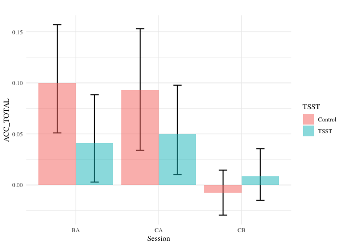

Analysis Cognitive
================

-   [Raw data](#raw-data)
    -   [All session](#all-session)
    -   [A - B](#a---b)
-   [Raw Change](#raw-change)
-   [Percentage Change](#percentage-change)

Raw data
--------

### All session

    ##               Df  Sum Sq Mean Sq F value Pr(>F)  
    ## session        2   56980   28490   3.790 0.0233 *
    ## TSST           1    1379    1379   0.183 0.6687  
    ## session:TSST   2    5050    2525   0.336 0.7149  
    ## Residuals    443 3330330    7518                 
    ## ---
    ## Signif. codes:  0 '***' 0.001 '**' 0.01 '*' 0.05 '.' 0.1 ' ' 1
    ## 1 observation deleted due to missingness

    ##               Df  Sum Sq Mean Sq F value Pr(>F)  
    ## session        2   57166   28583   3.583 0.0286 *
    ## TSST           1     282     282   0.035 0.8509  
    ## session:TSST   2    3515    1758   0.220 0.8024  
    ## Residuals    443 3534221    7978                 
    ## ---
    ## Signif. codes:  0 '***' 0.001 '**' 0.01 '*' 0.05 '.' 0.1 ' ' 1
    ## 1 observation deleted due to missingness

    ##               Df  Sum Sq Mean Sq F value Pr(>F)  
    ## session        2   56805   28402   3.717 0.0251 *
    ## TSST           1    3302    3302   0.432 0.5113  
    ## session:TSST   2    7015    3507   0.459 0.6322  
    ## Residuals    443 3385009    7641                 
    ## ---
    ## Signif. codes:  0 '***' 0.001 '**' 0.01 '*' 0.05 '.' 0.1 ' ' 1
    ## 1 observation deleted due to missingness

    ##               Df Sum Sq Mean Sq F value   Pr(>F)    
    ## session        2  0.494 0.24720   8.777 0.000183 ***
    ## TSST           1  0.033 0.03327   1.181 0.277652    
    ## session:TSST   2  0.064 0.03176   1.128 0.324686    
    ## Residuals    443 12.477 0.02816                     
    ## ---
    ## Signif. codes:  0 '***' 0.001 '**' 0.01 '*' 0.05 '.' 0.1 ' ' 1
    ## 1 observation deleted due to missingness

    ##               Df Sum Sq Mean Sq F value   Pr(>F)    
    ## session        2  0.440 0.21988   8.579 0.000221 ***
    ## TSST           1  0.044 0.04385   1.711 0.191520    
    ## session:TSST   2  0.049 0.02461   0.960 0.383606    
    ## Residuals    443 11.354 0.02563                     
    ## ---
    ## Signif. codes:  0 '***' 0.001 '**' 0.01 '*' 0.05 '.' 0.1 ' ' 1
    ## 1 observation deleted due to missingness

    ##               Df Sum Sq Mean Sq F value   Pr(>F)    
    ## session        2  0.555 0.27736   7.436 0.000666 ***
    ## TSST           1  0.024 0.02415   0.648 0.421405    
    ## session:TSST   2  0.080 0.03994   1.071 0.343576    
    ## Residuals    443 16.523 0.03730                     
    ## ---
    ## Signif. codes:  0 '***' 0.001 '**' 0.01 '*' 0.05 '.' 0.1 ' ' 1
    ## 1 observation deleted due to missingness

### A - B

    ##               Df  Sum Sq Mean Sq F value Pr(>F)  
    ## session        1   25655   25655   3.171  0.076 .
    ## TSST           1     689     689   0.085  0.771  
    ## session:TSST   1    5000    5000   0.618  0.432  
    ## Residuals    295 2386578    8090                 
    ## ---
    ## Signif. codes:  0 '***' 0.001 '**' 0.01 '*' 0.05 '.' 0.1 ' ' 1

    ##               Df  Sum Sq Mean Sq F value Pr(>F)  
    ## session        1   25207   25207   2.953 0.0868 .
    ## TSST           1     223     223   0.026 0.8716  
    ## session:TSST   1    3511    3511   0.411 0.5218  
    ## Residuals    295 2518219    8536                 
    ## ---
    ## Signif. codes:  0 '***' 0.001 '**' 0.01 '*' 0.05 '.' 0.1 ' ' 1

    ##               Df  Sum Sq Mean Sq F value Pr(>F)  
    ## session        1   26107   26107   3.157 0.0766 .
    ## TSST           1    1409    1409   0.170 0.6801  
    ## session:TSST   1    6753    6753   0.817 0.3669  
    ## Residuals    295 2439483    8269                 
    ## ---
    ## Signif. codes:  0 '***' 0.001 '**' 0.01 '*' 0.05 '.' 0.1 ' ' 1

    ##               Df Sum Sq Mean Sq F value Pr(>F)   
    ## session        1  0.366  0.3660   9.926 0.0018 **
    ## TSST           1  0.034  0.0339   0.918 0.3387   
    ## session:TSST   1  0.060  0.0598   1.622 0.2038   
    ## Residuals    295 10.878  0.0369                  
    ## ---
    ## Signif. codes:  0 '***' 0.001 '**' 0.01 '*' 0.05 '.' 0.1 ' ' 1

    ##               Df Sum Sq Mean Sq F value  Pr(>F)   
    ## session        1  0.305 0.30507   8.704 0.00343 **
    ## TSST           1  0.043 0.04304   1.228 0.26870   
    ## session:TSST   1  0.045 0.04521   1.290 0.25698   
    ## Residuals    295 10.340 0.03505                   
    ## ---
    ## Signif. codes:  0 '***' 0.001 '**' 0.01 '*' 0.05 '.' 0.1 ' ' 1

    ##               Df Sum Sq Mean Sq F value  Pr(>F)   
    ## session        1  0.432  0.4325   9.576 0.00216 **
    ## TSST           1  0.026  0.0258   0.571 0.45051   
    ## session:TSST   1  0.076  0.0765   1.693 0.19418   
    ## Residuals    295 13.323  0.0452                   
    ## ---
    ## Signif. codes:  0 '***' 0.001 '**' 0.01 '*' 0.05 '.' 0.1 ' ' 1

Raw Change
----------

Percentage Change
-----------------

