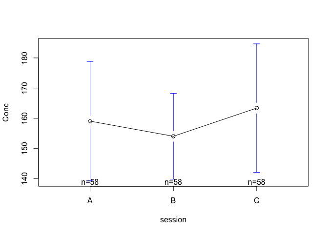
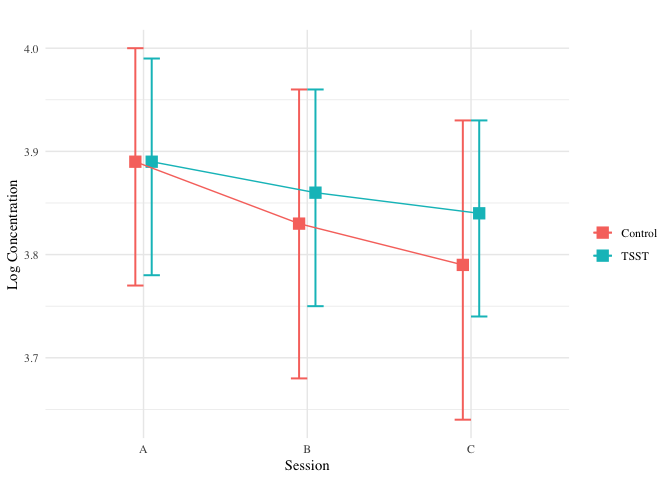

Analysis - Hormones
================
Wanitchaya Poonpatanapricha

C - A
-----

### Cortisol

#### Control

-   percentage change from baseline is not significant

    ## 
    ##  One Sample t-test
    ## 
    ## data:  Cort_per_diff_control$C
    ## t = 0.03277, df = 78, p-value = 0.9739
    ## alternative hypothesis: true mean is not equal to 0
    ## 95 percent confidence interval:
    ##  -0.08764963  0.09058340
    ## sample estimates:
    ##   mean of x 
    ## 0.001466887

#### All

-   percentage change from baseline is not significant

    ## 
    ##  One Sample t-test
    ## 
    ## data:  Cort_per_diff$C
    ## t = -1.3117, df = 155, p-value = 0.1915
    ## alternative hypothesis: true mean is not equal to 0
    ## 95 percent confidence interval:
    ##  -0.09289991  0.01875559
    ## sample estimates:
    ##   mean of x 
    ## -0.03707216

### Testosterone Female

#### Control

-   percentage change from baseline is not significant

    ## 
    ##  One Sample t-test
    ## 
    ## data:  Testo_F_per_diff_control$C
    ## t = -0.80537, df = 46, p-value = 0.4247
    ## alternative hypothesis: true mean is not equal to 0
    ## 95 percent confidence interval:
    ##  -0.06345317  0.02718738
    ## sample estimates:
    ##  mean of x 
    ## -0.0181329

#### All

-   percentage change from baseline is not significant

    ## 
    ##  One Sample t-test
    ## 
    ## data:  Testo_F_per_diff$C
    ## t = -0.76632, df = 93, p-value = 0.4454
    ## alternative hypothesis: true mean is not equal to 0
    ## 95 percent confidence interval:
    ##  -0.04207527  0.01864389
    ## sample estimates:
    ##   mean of x 
    ## -0.01171569

### Testosterone Male

#### Control

-   percentage change from baseline is not significant

    ## 
    ##  One Sample t-test
    ## 
    ## data:  Testo_M_per_diff_control$C
    ## t = 0.94053, df = 30, p-value = 0.3545
    ## alternative hypothesis: true mean is not equal to 0
    ## 95 percent confidence interval:
    ##  -0.08964516  0.24269978
    ## sample estimates:
    ##  mean of x 
    ## 0.07652731

#### All

-   percentage change from baseline is not significant

    ## 
    ##  One Sample t-test
    ## 
    ## data:  Testo_M_per_diff$C
    ## t = 1.1973, df = 60, p-value = 0.2359
    ## alternative hypothesis: true mean is not equal to 0
    ## 95 percent confidence interval:
    ##  -0.03433912  0.13674909
    ## sample estimates:
    ##  mean of x 
    ## 0.05120498

Tsst vs control
---------------

### Cortisol

| term              |    estimate|  std.error|   statistic|    p.value|
|:------------------|-----------:|----------:|-----------:|----------:|
| (Intercept)       |   0.1792658|  0.0181851|   9.8578172|  0.0000000|
| sessionB          |  -0.0188608|  0.0257177|  -0.7333773|  0.4637003|
| sessionC          |  -0.0294937|  0.0257177|  -1.1468248|  0.2520476|
| tsstTSST          |   0.0315524|  0.0258841|   1.2189844|  0.2234721|
| sessionB:tsstTSST |   0.0721984|  0.0366057|   1.9723275|  0.0491682|
| sessionC:tsstTSST |   0.0507404|  0.0366057|   1.3861347|  0.1663744|

|  r.squared|  adj.r.squared|      sigma|  statistic|   p.value|   df|
|----------:|--------------:|----------:|----------:|---------:|----:|
|  0.0593623|      0.0491822|  0.1616331|   5.831232|  3.09e-05|    6|

|                |   Df|      Sum Sq|    Mean Sq|     F value|  Pr(&gt;F)|
|----------------|----:|-----------:|----------:|-----------:|----------:|
| session        |    2|   0.0390877|  0.0195439|   0.7480827|  0.4738455|
| tsst           |    1|   0.6154226|  0.6154226|  23.5566161|  0.0000017|
| <session:tsst> |    2|   0.1072018|  0.0536009|   2.0516890|  0.1296870|
| Residuals      |  462|  12.0698686|  0.0261253|          NA|         NA|

### Testosterone

#### Female

| term              |    estimate|  std.error|   statistic|    p.value|
|:------------------|-----------:|----------:|-----------:|----------:|
| (Intercept)       |  52.8599149|   2.903675|  18.2044867|  0.0000000|
| sessionB          |  -2.1760000|   4.106417|  -0.5299024|  0.5966056|
| sessionC          |  -3.3096383|   4.106417|  -0.8059675|  0.4209555|
| tsstTSST          |  -1.1187660|   4.106417|  -0.2724434|  0.7854848|
| sessionB:tsstTSST |   0.7051489|   5.807350|   0.1214235|  0.9034439|
| sessionC:tsstTSST |   0.7504255|   5.807350|   0.1292200|  0.8972777|

|  r.squared|  adj.r.squared|     sigma|  statistic|    p.value|   df|
|----------:|--------------:|---------:|----------:|----------:|----:|
|  0.0040911|     -0.0139508|  19.90659|   0.226755|  0.9507231|    6|

|                |   Df|        Sum Sq|     Mean Sq|    F value|  Pr(&gt;F)|
|----------------|----:|-------------:|-----------:|----------:|----------:|
| session        |    2|  4.126617e+02|  206.330860|  0.5206793|  0.5946992|
| tsst           |    1|  2.829987e+01|   28.299871|  0.0714152|  0.7894869|
| <session:tsst> |    2|  8.322317e+00|    4.161159|  0.0105008|  0.9895546|
| Residuals      |  276|  1.093712e+05|  396.272468|         NA|         NA|

#### Male

| term              |    estimate|  std.error|   statistic|    p.value|
|:------------------|-----------:|----------:|-----------:|----------:|
| (Intercept)       |  173.857387|   12.44983|  13.9646354|  0.0000000|
| sessionB          |  -14.516137|   17.46863|  -0.8309832|  0.4070964|
| sessionC          |   -2.027645|   17.60672|  -0.1151631|  0.9084456|
| tsstTSST          |  -31.226487|   17.75284|  -1.7589573|  0.0803030|
| sessionB:tsstTSST |   17.548604|   25.00966|   0.7016731|  0.4837995|
| sessionC:tsstTSST |    9.375645|   25.10631|   0.3734378|  0.7092670|

|  r.squared|  adj.r.squared|     sigma|  statistic|    p.value|   df|
|----------:|--------------:|---------:|----------:|----------:|----:|
|   0.030932|      0.0037109|  69.31774|   1.136327|  0.3428709|    6|

|                |   Df|      Sum Sq|    Mean Sq|    F value|  Pr(&gt;F)|
|----------------|----:|-----------:|----------:|----------:|----------:|
| session        |    2|    2257.686|   1128.843|  0.2349334|  0.7908683|
| tsst           |    1|   22673.677|  22673.677|  4.7188173|  0.0311565|
| <session:tsst> |    2|    2368.593|   1184.296|  0.2464743|  0.7818178|
| Residuals      |  178|  855280.929|   4804.949|         NA|         NA|
