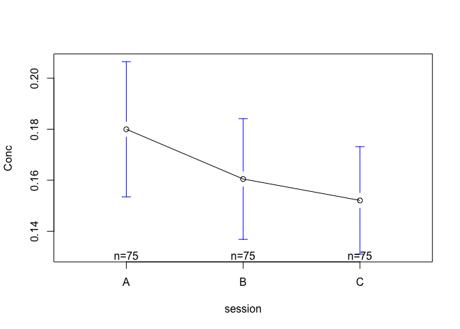
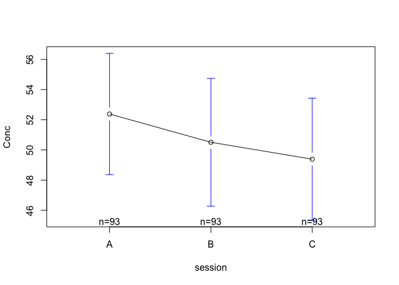
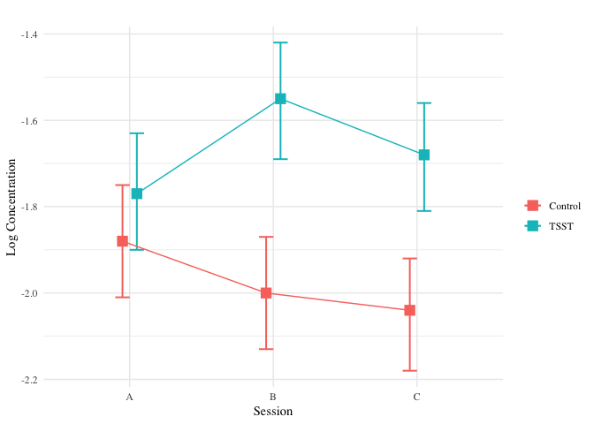

Analysis - Hormones
================
Wanitchaya Poonpatanapricha

C - A
-----

### Cortisol

#### Control

-   percentage change from baseline is not significant

    ## 
    ##  One Sample t-test
    ## 
    ## data:  Cort_per_diff_control$C
    ## t = 0.35797, df = 74, p-value = 0.7214
    ## alternative hypothesis: true mean is not equal to 0
    ## 95 percent confidence interval:
    ##  -0.07520627  0.10814650
    ## sample estimates:
    ##  mean of x 
    ## 0.01647012

#### All

-   percentage change from baseline is not significant

    ## 
    ##  One Sample t-test
    ## 
    ## data:  Cort_per_diff$C
    ## t = -1.1175, df = 150, p-value = 0.2656
    ## alternative hypothesis: true mean is not equal to 0
    ## 95 percent confidence interval:
    ##  -0.08901719  0.02470302
    ## sample estimates:
    ##   mean of x 
    ## -0.03215709

### Testosterone Female

#### Control

-   percentage change from baseline is not significant

    ## 
    ##  One Sample t-test
    ## 
    ## data:  Testo_F_per_diff_control$C
    ## t = -0.80537, df = 46, p-value = 0.4247
    ## alternative hypothesis: true mean is not equal to 0
    ## 95 percent confidence interval:
    ##  -0.06345317  0.02718738
    ## sample estimates:
    ##  mean of x 
    ## -0.0181329

#### All

-   percentage change from baseline is not significant

    ## 
    ##  One Sample t-test
    ## 
    ## data:  Testo_F_per_diff$C
    ## t = -0.76161, df = 92, p-value = 0.4482
    ## alternative hypothesis: true mean is not equal to 0
    ## 95 percent confidence interval:
    ##  -0.04246161  0.01892240
    ## sample estimates:
    ##  mean of x 
    ## -0.0117696

### Testosterone Male

#### Control

-   percentage change from baseline is not significant

    ## 
    ##  One Sample t-test
    ## 
    ## data:  Testo_M_per_diff_control$C
    ## t = 1.094, df = 27, p-value = 0.2836
    ## alternative hypothesis: true mean is not equal to 0
    ## 95 percent confidence interval:
    ##  -0.08551675  0.28086065
    ## sample estimates:
    ##  mean of x 
    ## 0.09767195

#### All

-   percentage change from baseline is not significant

    ## 
    ##  One Sample t-test
    ## 
    ## data:  Testo_M_per_diff$C
    ## t = 1.3453, df = 57, p-value = 0.1839
    ## alternative hypothesis: true mean is not equal to 0
    ## 95 percent confidence interval:
    ##  -0.02936063  0.14956656
    ## sample estimates:
    ##  mean of x 
    ## 0.06010296

Tsst vs control
---------------

### Cortisol

| term              |    estimate|  std.error|   statistic|    p.value|
|:------------------|-----------:|----------:|-----------:|----------:|
| (Intercept)       |   0.1799867|  0.0188095|   9.5689479|  0.0000000|
| sessionB          |  -0.0195067|  0.0266006|  -0.7333173|  0.4637493|
| sessionC          |  -0.0279067|  0.0266006|  -1.0490998|  0.2946990|
| tsstTSST          |   0.0304212|  0.0265129|   1.1474108|  0.2518256|
| sessionB:tsstTSST |   0.0702830|  0.0374950|   1.8744651|  0.0615183|
| sessionC:tsstTSST |   0.0449330|  0.0374950|   1.1983741|  0.2314064|

|  r.squared|  adj.r.squared|      sigma|  statistic|    p.value|   df|
|----------:|--------------:|----------:|----------:|----------:|----:|
|  0.0533703|      0.0427816|  0.1628946|   5.040307|  0.0001665|    6|

|                |   Df|      Sum Sq|    Mean Sq|     F value|  Pr(&gt;F)|
|----------------|----:|-----------:|----------:|-----------:|----------:|
| session        |    2|   0.0366164|  0.0183082|   0.6899735|  0.5021227|
| tsst           |    1|   0.5364524|  0.5364524|  20.2170418|  0.0000088|
| <session:tsst> |    2|   0.0956454|  0.0478227|   1.8022730|  0.1661199|
| Residuals      |  447|  11.8609937|  0.0265347|          NA|         NA|

### Testosterone

#### Female

| term              |    estimate|  std.error|   statistic|    p.value|
|:------------------|-----------:|----------:|-----------:|----------:|
| (Intercept)       |  52.8599149|   2.918814|  18.1100672|  0.0000000|
| sessionB          |  -2.1760000|   4.127826|  -0.5271540|  0.5985148|
| sessionC          |  -3.3096383|   4.127826|  -0.8017872|  0.4233734|
| tsstTSST          |  -0.9694801|   4.150199|  -0.2335984|  0.8154718|
| sessionB:tsstTSST |   0.6106957|   5.869268|   0.1040497|  0.9172063|
| sessionC:tsstTSST |   0.6392687|   5.869268|   0.1089180|  0.9133476|

|  r.squared|  adj.r.squared|     sigma|  statistic|    p.value|   df|
|----------:|--------------:|---------:|----------:|----------:|----:|
|  0.0041258|     -0.0141137|  20.01038|  0.2262009|  0.9509724|    6|

|                |   Df|        Sum Sq|     Mean Sq|    F value|  Pr(&gt;F)|
|----------------|----:|-------------:|-----------:|----------:|----------:|
| session        |    2|  4.254941e+02|  212.747027|  0.5313159|  0.5884375|
| tsst           |    1|  2.131424e+01|   21.314239|  0.0532303|  0.8177075|
| <session:tsst> |    2|  6.063132e+00|    3.031566|  0.0075711|  0.9924577|
| Residuals      |  273|  1.093134e+05|  400.415292|         NA|         NA|

#### Male

| term              |    estimate|  std.error|   statistic|    p.value|
|:------------------|-----------:|----------:|-----------:|----------:|
| (Intercept)       |  176.582357|   13.30120|  13.2756724|  0.0000000|
| sessionB          |  -13.654321|   18.81074|  -0.7258792|  0.4689228|
| sessionC          |    1.097464|   18.81074|   0.0583424|  0.9535452|
| tsstTSST          |  -33.951457|   18.49457|  -1.8357531|  0.0681620|
| sessionB:tsstTSST |   16.686788|   26.15527|   0.6379896|  0.5243491|
| sessionC:tsstTSST |    6.250536|   26.15527|   0.2389781|  0.8114138|

|  r.squared|  adj.r.squared|     sigma|  statistic|    p.value|   df|
|----------:|--------------:|---------:|----------:|----------:|----:|
|  0.0399885|      0.0114167|  70.38333|    1.39958|  0.2268963|    6|

|                |   Df|      Sum Sq|    Mean Sq|    F value|  Pr(&gt;F)|
|----------------|----:|-----------:|----------:|----------:|----------:|
| session        |    2|    2541.911|   1270.956|  0.2565611|  0.7740103|
| tsst           |    1|   30065.726|  30065.726|  6.0692091|  0.0147634|
| <session:tsst> |    2|    2058.644|   1029.322|  0.2077838|  0.8125911|
| Residuals      |  168|  832240.561|   4953.813|         NA|         NA|
