Analysis - Hormones
================
Wanitchaya Poonpatanapricha

A - B - C
---------

### Cortisol

#### Control

#### All

### Testosterone Female

#### Control

#### All

### Testosterone Male

#### Control

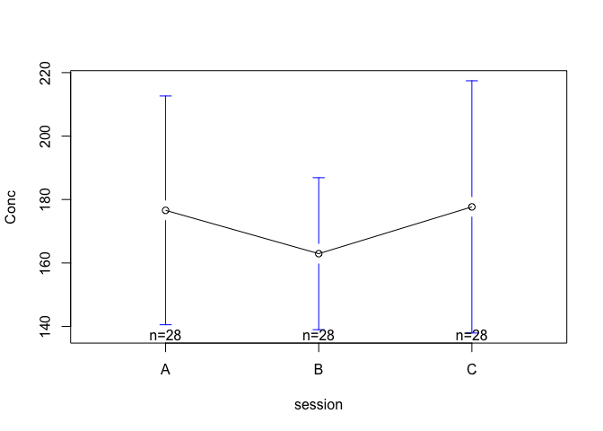

#### All

Tsst vs control
---------------

### Cortisol

    ##               Df Sum Sq Mean Sq F value   Pr(>F)    
    ## session        2   0.60   0.301   0.904 0.405965    
    ## tsst           1   9.33   9.334  28.066 2.15e-07 ***
    ## rMEQ_1_5       1   6.49   6.485  19.500 1.37e-05 ***
    ## sMARS          1   3.89   3.889  11.693 0.000707 ***
    ## Dem_RelTerm    1   9.48   9.484  28.516 1.74e-07 ***
    ## Dem_RelStab    1   0.62   0.620   1.865 0.173034    
    ## Dem_Commit     1   2.47   2.475   7.440 0.006721 ** 
    ## session:tsst   2   1.83   0.915   2.751 0.065362 .  
    ## Residuals    328 109.08   0.333                     
    ## ---
    ## Signif. codes:  0 '***' 0.001 '**' 0.01 '*' 0.05 '.' 0.1 ' ' 1
    ## 114 observations deleted due to missingness

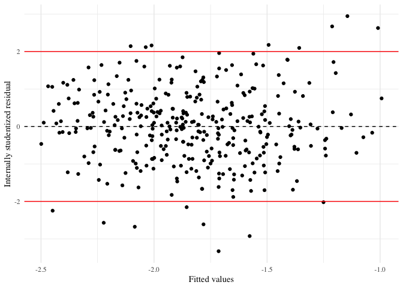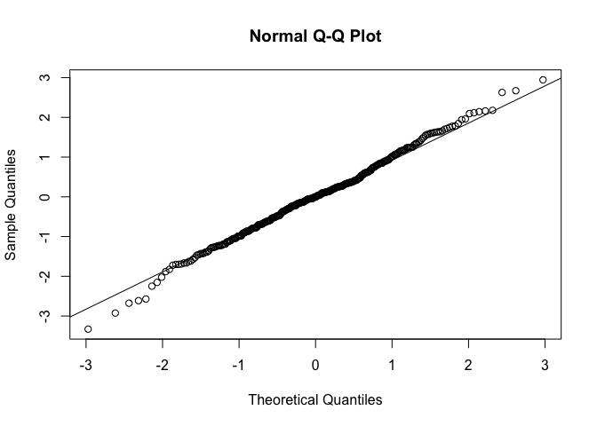

### Testosterone

#### Female

-   May need to use sqrt instead of log

    ##               Df Sum Sq Mean Sq F value   Pr(>F)    
    ## session        2    425     213   0.645 0.525570    
    ## tsst           1     21      21   0.065 0.799561    
    ## eat_drink      1   3523    3523  10.676 0.001226 ** 
    ## Dem_Contra     1   8598    8598  26.059 6.27e-07 ***
    ## BFI_C          1   4985    4985  15.110 0.000128 ***
    ## TIPI_O         1   3455    3455  10.471 0.001364 ** 
    ## session:tsst   2      6       3   0.009 0.990854    
    ## Residuals    269  88753     330                     
    ## ---
    ## Signif. codes:  0 '***' 0.001 '**' 0.01 '*' 0.05 '.' 0.1 ' ' 1

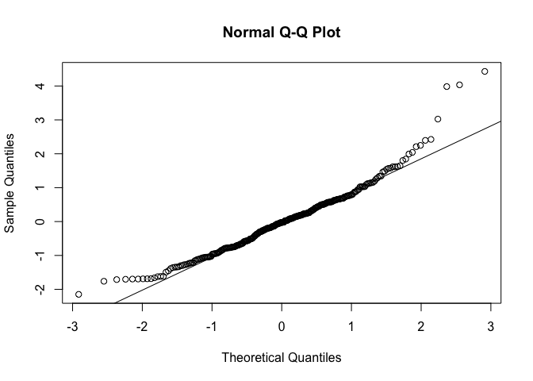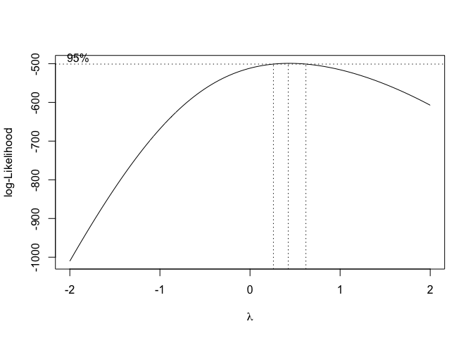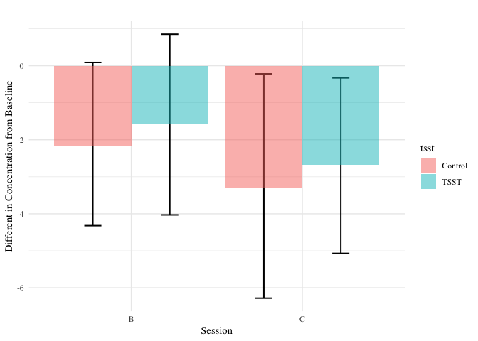

    ##               Df Sum Sq Mean Sq F value   Pr(>F)    
    ## session        2   0.25   0.123   0.847 0.429727    
    ## tsst           1   0.04   0.044   0.300 0.584572    
    ## eat_drink      1   1.06   1.058   7.265 0.007472 ** 
    ## Dem_Contra     1   3.84   3.836  26.351 5.46e-07 ***
    ## BFI_C          1   2.36   2.359  16.204 7.40e-05 ***
    ## TIPI_O         1   1.62   1.617  11.107 0.000981 ***
    ## session:tsst   2   0.02   0.011   0.078 0.924879    
    ## Residuals    269  39.16   0.146                     
    ## ---
    ## Signif. codes:  0 '***' 0.001 '**' 0.01 '*' 0.05 '.' 0.1 ' ' 1

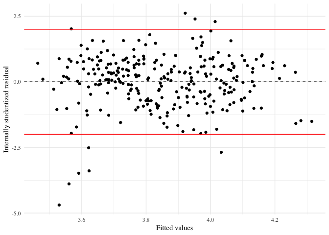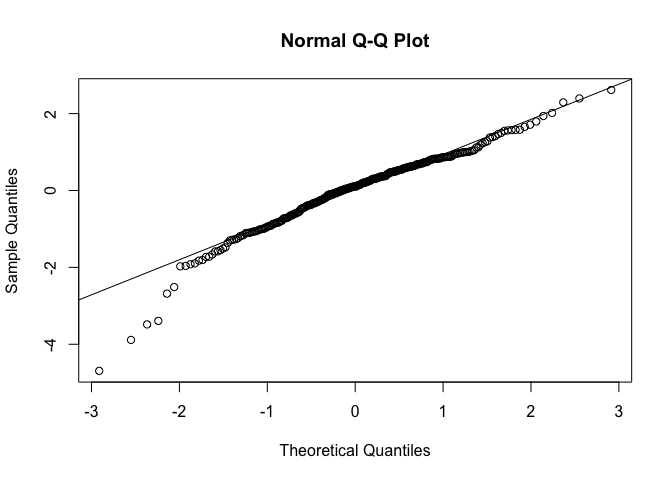

    ##               Df Sum Sq Mean Sq F value   Pr(>F)    
    ## session        2    2.4    1.20   0.769  0.46450    
    ## tsst           1    0.0    0.02   0.013  0.90864    
    ## eat_drink      1   15.2   15.21   9.730  0.00201 ** 
    ## Dem_Contra     1   42.3   42.33  27.073 3.89e-07 ***
    ## BFI_C          1   26.0   26.01  16.638 5.97e-05 ***
    ## TIPI_O         1   17.0   16.99  10.869  0.00111 ** 
    ## session:tsst   2    0.1    0.05   0.030  0.97089    
    ## Residuals    269  420.6    1.56                     
    ## ---
    ## Signif. codes:  0 '***' 0.001 '**' 0.01 '*' 0.05 '.' 0.1 ' ' 1

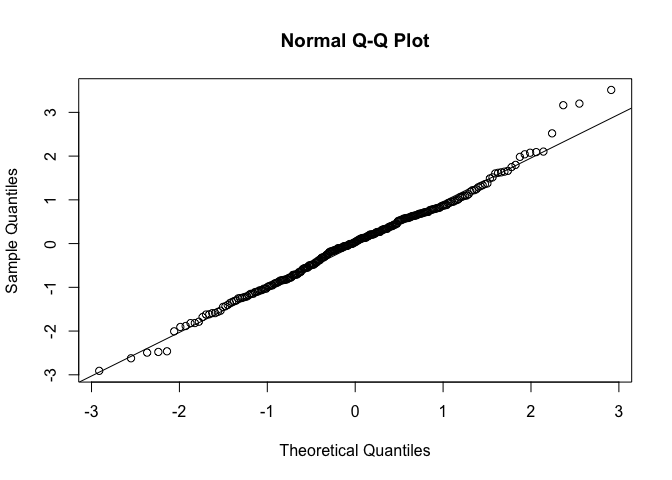

#### Male

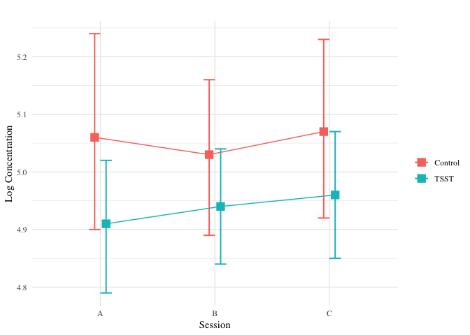

    ##               Df Sum Sq Mean Sq F value   Pr(>F)    
    ## session        2  0.037  0.0185   0.147 0.863479    
    ## tsst           1  0.623  0.6234   4.960 0.027297 *  
    ## eat_drink      1  0.729  0.7285   5.796 0.017166 *  
    ## Dem_Smoke      1  1.540  1.5396  12.249 0.000599 ***
    ## LTMO           1  0.791  0.7912   6.295 0.013075 *  
    ## session:tsst   2  0.039  0.0193   0.153 0.858117    
    ## Residuals    165 20.740  0.1257                     
    ## ---
    ## Signif. codes:  0 '***' 0.001 '**' 0.01 '*' 0.05 '.' 0.1 ' ' 1

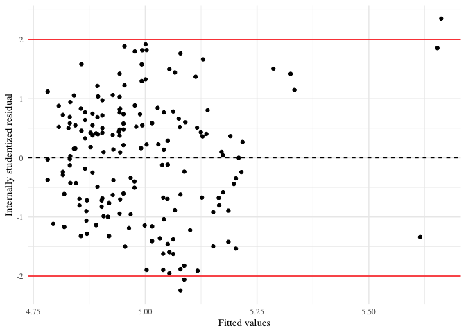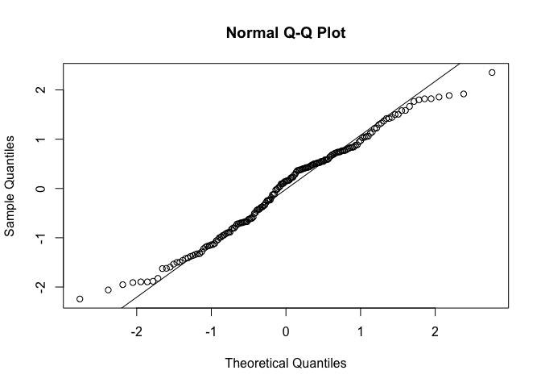

By Time slot
------------

### Cortisol

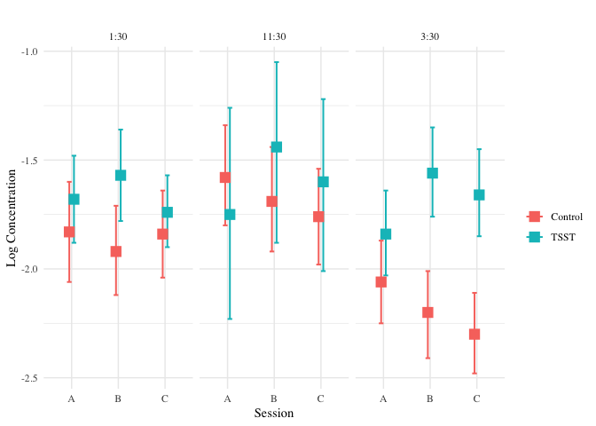

    ##                    Df Sum Sq Mean Sq F value   Pr(>F)    
    ## session             2   0.60   0.301   0.955 0.385826    
    ## tsst                1   9.33   9.334  29.658 1.04e-07 ***
    ## time                2   7.36   3.682  11.699 1.25e-05 ***
    ## rMEQ_1_5            1   4.18   4.183  13.291 0.000312 ***
    ## sMARS               1   4.29   4.286  13.619 0.000264 ***
    ## Dem_RelTerm         1  10.37  10.373  32.959 2.21e-08 ***
    ## Dem_RelStab         1   0.62   0.618   1.965 0.161966    
    ## Dem_Commit          1   2.28   2.275   7.229 0.007552 ** 
    ## session:tsst        2   1.83   0.915   2.907 0.056122 .  
    ## session:time        4   0.13   0.033   0.105 0.980674    
    ## tsst:time           2   2.71   1.353   4.298 0.014405 *  
    ## session:tsst:time   4   0.65   0.162   0.514 0.725829    
    ## Residuals         316  99.45   0.315                     
    ## ---
    ## Signif. codes:  0 '***' 0.001 '**' 0.01 '*' 0.05 '.' 0.1 ' ' 1
    ## 114 observations deleted due to missingness

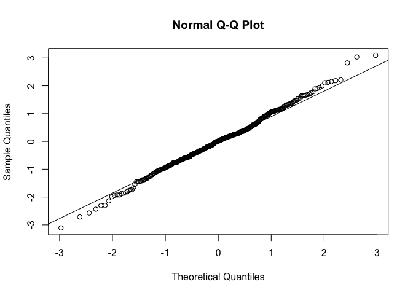

### Testosterone

#### Female

-   May need sqrt

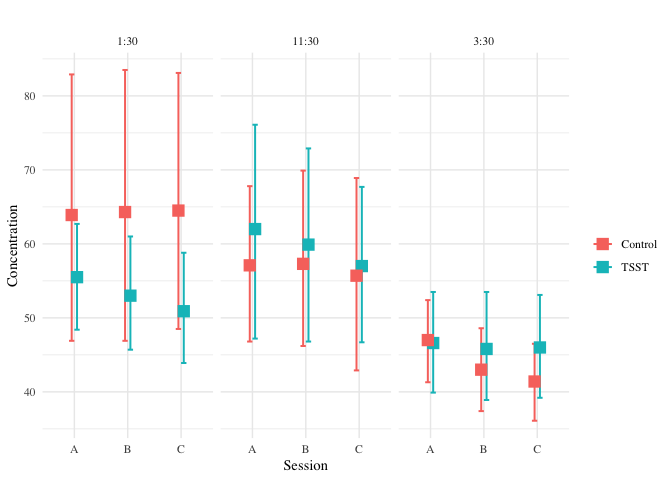

    ##                    Df Sum Sq Mean Sq F value   Pr(>F)    
    ## session             2    425     213   0.682 0.506387    
    ## tsst                1     21      21   0.068 0.793960    
    ## time                2  11417    5709  18.307 3.69e-08 ***
    ## eat_drink           1   2303    2303   7.385 0.007024 ** 
    ## Dem_Contra          1   6424    6424  20.600 8.70e-06 ***
    ## BFI_C               1   4461    4461  14.306 0.000193 ***
    ## TIPI_O              1   3016    3016   9.673 0.002081 ** 
    ## session:tsst        2      6       3   0.010 0.990326    
    ## session:time        4     25       6   0.020 0.999199    
    ## tsst:time           2   1263     631   2.025 0.134113    
    ## session:tsst:time   4    264      66   0.212 0.931624    
    ## Residuals         257  80140     312                     
    ## ---
    ## Signif. codes:  0 '***' 0.001 '**' 0.01 '*' 0.05 '.' 0.1 ' ' 1

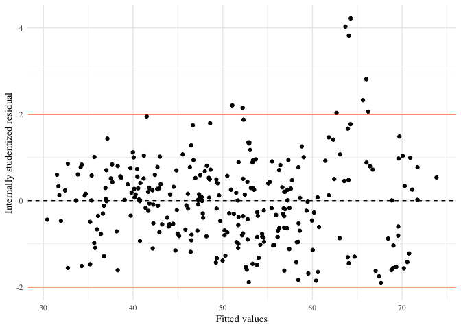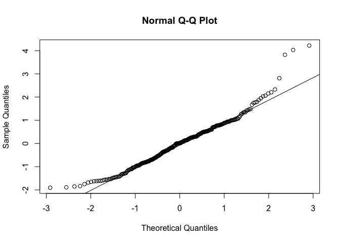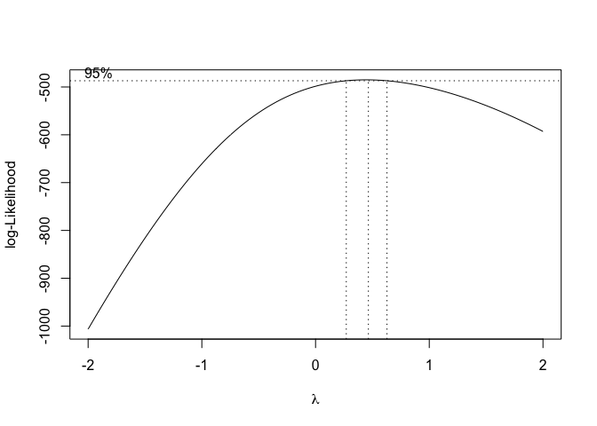

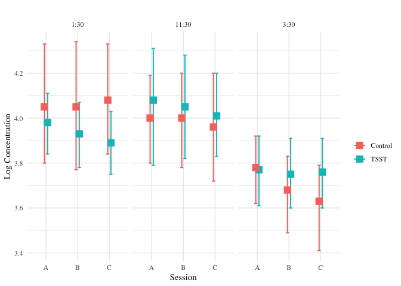

    ##                    Df Sum Sq Mean Sq F value   Pr(>F)    
    ## session             2   0.25  0.1233   0.890  0.41210    
    ## tsst                1   0.04  0.0436   0.315  0.57537    
    ## time                2   4.83  2.4151  17.417 8.06e-08 ***
    ## eat_drink           1   0.65  0.6510   4.695  0.03116 *  
    ## Dem_Contra          1   2.89  2.8852  20.808 7.87e-06 ***
    ## BFI_C               1   2.22  2.2217  16.022 8.19e-05 ***
    ## TIPI_O              1   1.48  1.4850  10.709  0.00121 ** 
    ## session:tsst        2   0.02  0.0114   0.082  0.92128    
    ## session:time        4   0.03  0.0071   0.051  0.99513    
    ## tsst:time           2   0.14  0.0697   0.503  0.60556    
    ## session:tsst:time   4   0.15  0.0387   0.279  0.89151    
    ## Residuals         257  35.64  0.1387                     
    ## ---
    ## Signif. codes:  0 '***' 0.001 '**' 0.01 '*' 0.05 '.' 0.1 ' ' 1

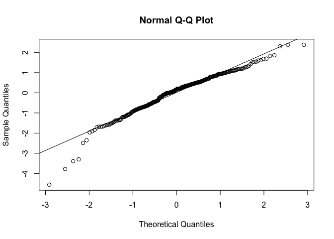

    ##                    Df Sum Sq Mean Sq F value   Pr(>F)    
    ## session             2    2.4    1.20   0.813  0.44476    
    ## tsst                1    0.0    0.02   0.014  0.90609    
    ## time                2   55.1   27.54  18.619 2.81e-08 ***
    ## eat_drink           1    9.8    9.83   6.648  0.01048 *  
    ## Dem_Contra          1   31.7   31.71  21.436 5.81e-06 ***
    ## BFI_C               1   24.1   24.06  16.263 7.27e-05 ***
    ## TIPI_O              1   15.3   15.28  10.329  0.00148 ** 
    ## session:tsst        2    0.1    0.05   0.031  0.96926    
    ## session:time        4    0.2    0.05   0.032  0.99801    
    ## tsst:time           2    3.3    1.66   1.126  0.32605    
    ## session:tsst:time   4    1.5    0.37   0.249  0.90998    
    ## Residuals         257  380.2    1.48                     
    ## ---
    ## Signif. codes:  0 '***' 0.001 '**' 0.01 '*' 0.05 '.' 0.1 ' ' 1

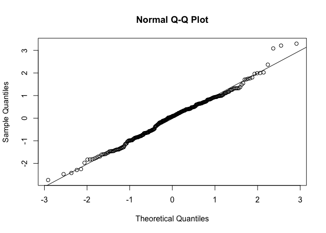

#### Male

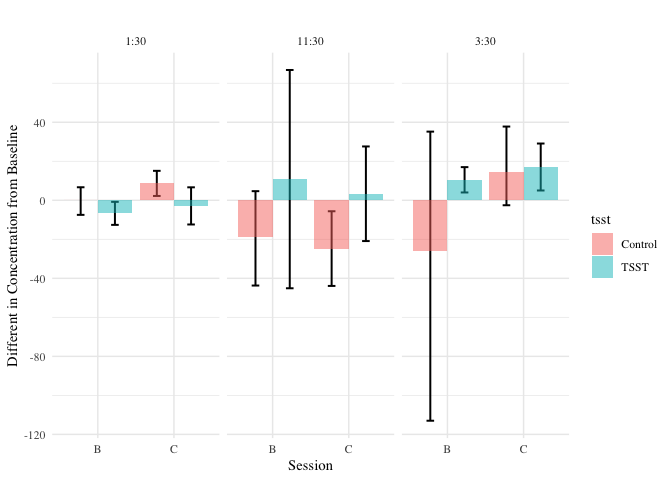

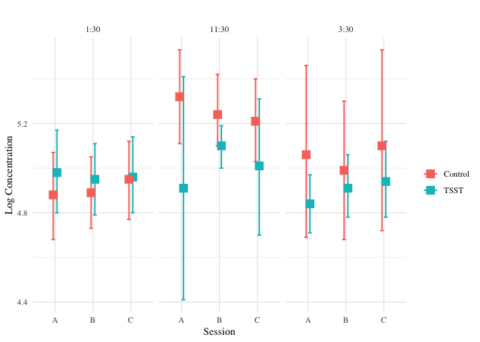

    ##                    Df Sum Sq Mean Sq F value  Pr(>F)   
    ## session             2  0.037  0.0185   0.149 0.86196   
    ## tsst                1  0.623  0.6234   5.020 0.02650 * 
    ## time                2  1.252  0.6260   5.040 0.00759 **
    ## eat_drink           1  1.062  1.0617   8.549 0.00398 **
    ## Dem_Smoke           1  0.955  0.9549   7.689 0.00625 **
    ## LTMO                1  0.890  0.8900   7.166 0.00824 **
    ## session:tsst        2  0.039  0.0193   0.155 0.85654   
    ## session:time        4  0.086  0.0214   0.173 0.95210   
    ## tsst:time           2  0.451  0.2253   1.814 0.16653   
    ## session:tsst:time   4  0.103  0.0257   0.207 0.93425   
    ## Residuals         153 19.001  0.1242                   
    ## ---
    ## Signif. codes:  0 '***' 0.001 '**' 0.01 '*' 0.05 '.' 0.1 ' ' 1

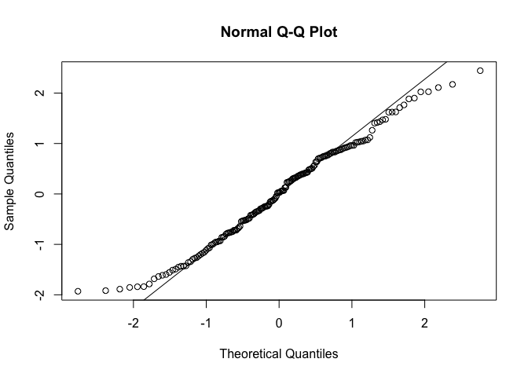
