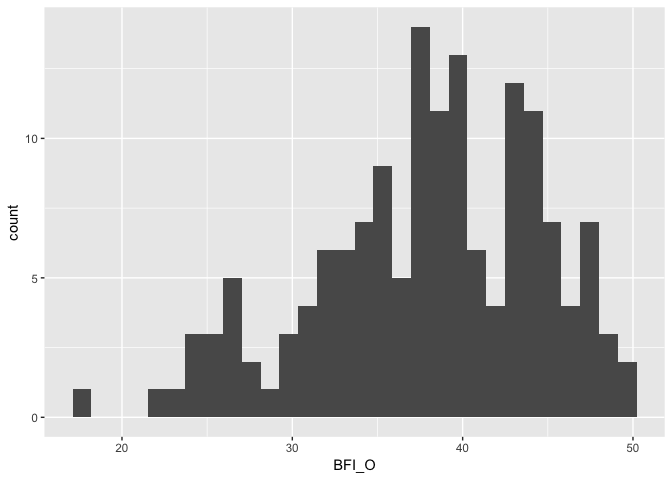
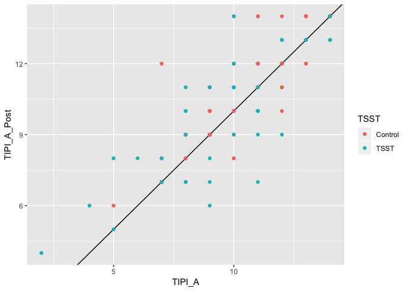

Analysis - BFI
================
Wanitchaya Poonpatanapricha

Big Five
--------

    

Big Five & TIPI
---------------

TIPI
----

### Pre-post

-   no change in TIPI 

<!-- -->

    ## 
    ##  Welch Two Sample t-test
    ## 
    ## data:  survey$TIPI_E_Post and survey$TIPI_E
    ## t = 0.98329, df = 299.98, p-value = 0.3263
    ## alternative hypothesis: true difference in means is not equal to 0
    ## 95 percent confidence interval:
    ##  -0.3713603  1.1130822
    ## sample estimates:
    ## mean of x mean of y 
    ##  8.112583  7.741722

    ## 
    ##  Welch Two Sample t-test
    ## 
    ## data:  survey_tsst$TIPI_E_Post and survey_tsst$TIPI_E
    ## t = 0.4636, df = 150, p-value = 0.6436
    ## alternative hypothesis: true difference in means is not equal to 0
    ## 95 percent confidence interval:
    ##  -0.8155261  1.3155261
    ## sample estimates:
    ## mean of x mean of y 
    ##  7.644737  7.394737

    ## 
    ##  Welch Two Sample t-test
    ## 
    ## data:  survey_control$TIPI_E_Post and survey_control$TIPI_E
    ## t = 0.94501, df = 147.99, p-value = 0.3462
    ## alternative hypothesis: true difference in means is not equal to 0
    ## 95 percent confidence interval:
    ##  -0.5382874  1.5249541
    ## sample estimates:
    ## mean of x mean of y 
    ##  8.586667  8.093333

    ## 
    ##  Paired t-test
    ## 
    ## data:  survey$TIPI_A_Post and survey$TIPI_A
    ## t = 3.5642, df = 150, p-value = 0.0004899
    ## alternative hypothesis: true difference in means is not equal to 0
    ## 95 percent confidence interval:
    ##  0.1652622 0.5764596
    ## sample estimates:
    ## mean of the differences 
    ##               0.3708609

    ## 
    ##  Paired t-test
    ## 
    ## data:  survey_tsst$TIPI_A_Post and survey_tsst$TIPI_A
    ## t = 1.8707, df = 75, p-value = 0.06528
    ## alternative hypothesis: true difference in means is not equal to 0
    ## 95 percent confidence interval:
    ##  -0.02048611  0.65206506
    ## sample estimates:
    ## mean of the differences 
    ##               0.3157895

    ## 
    ##  Paired t-test
    ## 
    ## data:  survey_control$TIPI_A_Post and survey_control$TIPI_A
    ## t = 3.5028, df = 74, p-value = 0.0007848
    ## alternative hypothesis: true difference in means is not equal to 0
    ## 95 percent confidence interval:
    ##  0.1839585 0.6693748
    ## sample estimates:
    ## mean of the differences 
    ##               0.4266667

    ## 
    ##  Paired t-test
    ## 
    ## data:  survey$TIPI_C_Post and survey$TIPI_C
    ## t = -0.059671, df = 150, p-value = 0.9525
    ## alternative hypothesis: true difference in means is not equal to 0
    ## 95 percent confidence interval:
    ##  -0.2259176  0.2126726
    ## sample estimates:
    ## mean of the differences 
    ##            -0.006622517

    ## 
    ##  Paired t-test
    ## 
    ## data:  survey_tsst$TIPI_C_Post and survey_tsst$TIPI_C
    ## t = -1.4421, df = 75, p-value = 0.1534
    ## alternative hypothesis: true difference in means is not equal to 0
    ## 95 percent confidence interval:
    ##  -0.56400433  0.09032012
    ## sample estimates:
    ## mean of the differences 
    ##              -0.2368421

    ## 
    ##  Paired t-test
    ## 
    ## data:  survey_control$TIPI_C_Post and survey_control$TIPI_C
    ## t = 1.5602, df = 74, p-value = 0.123
    ## alternative hypothesis: true difference in means is not equal to 0
    ## 95 percent confidence interval:
    ##  -0.06281848  0.51615181
    ## sample estimates:
    ## mean of the differences 
    ##               0.2266667

    ## 
    ##  Paired t-test
    ## 
    ## data:  survey$TIPI_ES_Post and survey$TIPI_ES
    ## t = 2.3536, df = 150, p-value = 0.01989
    ## alternative hypothesis: true difference in means is not equal to 0
    ## 95 percent confidence interval:
    ##  0.04676134 0.53602012
    ## sample estimates:
    ## mean of the differences 
    ##               0.2913907

    ## 
    ##  Paired t-test
    ## 
    ## data:  survey_tsst$TIPI_ES_Post and survey_tsst$TIPI_ES
    ## t = 1.7026, df = 75, p-value = 0.09279
    ## alternative hypothesis: true difference in means is not equal to 0
    ## 95 percent confidence interval:
    ##  -0.05594192  0.71383665
    ## sample estimates:
    ## mean of the differences 
    ##               0.3289474

    ## 
    ##  Paired t-test
    ## 
    ## data:  survey_control$TIPI_ES_Post and survey_control$TIPI_ES
    ## t = 1.6292, df = 74, p-value = 0.1075
    ## alternative hypothesis: true difference in means is not equal to 0
    ## 95 percent confidence interval:
    ##  -0.05649134  0.56315801
    ## sample estimates:
    ## mean of the differences 
    ##               0.2533333

    ## 
    ##  Paired t-test
    ## 
    ## data:  survey$TIPI_O_Post and survey$TIPI_O
    ## t = -0.87721, df = 150, p-value = 0.3818
    ## alternative hypothesis: true difference in means is not equal to 0
    ## 95 percent confidence interval:
    ##  -0.3661754  0.1410098
    ## sample estimates:
    ## mean of the differences 
    ##              -0.1125828

    ## 
    ##  Paired t-test
    ## 
    ## data:  survey_tsst$TIPI_O_Post and survey_tsst$TIPI_O
    ## t = -0.35063, df = 75, p-value = 0.7268
    ## alternative hypothesis: true difference in means is not equal to 0
    ## 95 percent confidence interval:
    ##  -0.4395699  0.3079909
    ## sample estimates:
    ## mean of the differences 
    ##             -0.06578947

    ## 
    ##  Paired t-test
    ## 
    ## data:  survey_control$TIPI_O_Post and survey_control$TIPI_O
    ## t = -0.90866, df = 74, p-value = 0.3665
    ## alternative hypothesis: true difference in means is not equal to 0
    ## 95 percent confidence interval:
    ##  -0.5108541  0.1908541
    ## sample estimates:
    ## mean of the differences 
    ##                   -0.16
