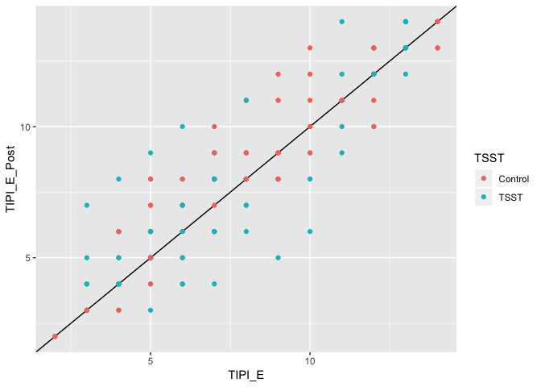

Analysis - Hormone/BFI
================
Wanitchaya Poonpatanapricha

Big Five
--------

    

Big Five & TIPI
---------------

-   significantly correlated for all 5 dimensions 

TIPI
----

### Pre-post

-   no change in TIPI 

<!-- -->

    ## 
    ##  Welch Two Sample t-test
    ## 
    ## data:  survey$TIPI_E_Post and survey$TIPI_E
    ## t = 0.94595, df = 305.92, p-value = 0.3449
    ## alternative hypothesis: true difference in means is not equal to 0
    ## 95 percent confidence interval:
    ##  -0.3857787  1.1000645
    ## sample estimates:
    ## mean of x mean of y 
    ##  8.032468  7.675325

    ## 
    ##  Welch Two Sample t-test
    ## 
    ## data:  survey_tsst$TIPI_E_Post and survey_tsst$TIPI_E
    ## t = 0.3817, df = 151.92, p-value = 0.7032
    ## alternative hypothesis: true difference in means is not equal to 0
    ## 95 percent confidence interval:
    ##  -0.8677635  1.2833480
    ## sample estimates:
    ## mean of x mean of y 
    ##  7.545455  7.337662

    ## 
    ##  Welch Two Sample t-test
    ## 
    ## data:  survey_control$TIPI_E_Post and survey_control$TIPI_E
    ## t = 0.97779, df = 152, p-value = 0.3297
    ## alternative hypothesis: true difference in means is not equal to 0
    ## 95 percent confidence interval:
    ##  -0.5169081  1.5298951
    ## sample estimates:
    ## mean of x mean of y 
    ##  8.519481  8.012987

    ## 
    ##  Welch Two Sample t-test
    ## 
    ## data:  survey$TIPI_A_Post and survey$TIPI_A
    ## t = 0.89288, df = 305.13, p-value = 0.3726
    ## alternative hypothesis: true difference in means is not equal to 0
    ## 95 percent confidence interval:
    ##  -0.2970498  0.7905563
    ## sample estimates:
    ## mean of x mean of y 
    ##  10.67532  10.42857

    ## 
    ##  Welch Two Sample t-test
    ## 
    ## data:  survey_tsst$TIPI_A_Post and survey_tsst$TIPI_A
    ## t = 0.36466, df = 150.88, p-value = 0.7159
    ## alternative hypothesis: true difference in means is not equal to 0
    ## 95 percent confidence interval:
    ##  -0.6885554  1.0002437
    ## sample estimates:
    ## mean of x mean of y 
    ##  10.40260  10.24675

    ## 
    ##  Welch Two Sample t-test
    ## 
    ## data:  survey_control$TIPI_A_Post and survey_control$TIPI_A
    ## t = 0.96662, df = 152, p-value = 0.3353
    ## alternative hypothesis: true difference in means is not equal to 0
    ## 95 percent confidence interval:
    ##  -0.3524952  1.0278199
    ## sample estimates:
    ## mean of x mean of y 
    ##  10.94805  10.61039

    ## 
    ##  Welch Two Sample t-test
    ## 
    ## data:  survey$TIPI_C_Post and survey$TIPI_C
    ## t = -0.41028, df = 305.37, p-value = 0.6819
    ## alternative hypothesis: true difference in means is not equal to 0
    ## 95 percent confidence interval:
    ##  -0.7903824  0.5176551
    ## sample estimates:
    ## mean of x mean of y 
    ##  10.38312  10.51948

    ## 
    ##  Welch Two Sample t-test
    ## 
    ## data:  survey_tsst$TIPI_C_Post and survey_tsst$TIPI_C
    ## t = -0.88073, df = 149.36, p-value = 0.3799
    ## alternative hypothesis: true difference in means is not equal to 0
    ## 95 percent confidence interval:
    ##  -1.347978  0.516809
    ## sample estimates:
    ## mean of x mean of y 
    ##  10.15584  10.57143

    ## 
    ##  Welch Two Sample t-test
    ## 
    ## data:  survey_control$TIPI_C_Post and survey_control$TIPI_C
    ## t = 0.3041, df = 151.64, p-value = 0.7615
    ## alternative hypothesis: true difference in means is not equal to 0
    ## 95 percent confidence interval:
    ##  -0.7852961  1.0710104
    ## sample estimates:
    ## mean of x mean of y 
    ##  10.61039  10.46753

    ## 
    ##  Welch Two Sample t-test
    ## 
    ## data:  survey$TIPI_ES_Post and survey$TIPI_ES
    ## t = 0.64979, df = 305.82, p-value = 0.5163
    ## alternative hypothesis: true difference in means is not equal to 0
    ## 95 percent confidence interval:
    ##  -0.4609782  0.9155237
    ## sample estimates:
    ## mean of x mean of y 
    ##  9.571429  9.344156

    ## 
    ##  Welch Two Sample t-test
    ## 
    ## data:  survey_tsst$TIPI_ES_Post and survey_tsst$TIPI_ES
    ## t = 0.39788, df = 150.14, p-value = 0.6913
    ## alternative hypothesis: true difference in means is not equal to 0
    ## 95 percent confidence interval:
    ##  -0.7726023  1.1622127
    ## sample estimates:
    ## mean of x mean of y 
    ##  8.922078  8.727273

    ## 
    ##  Welch Two Sample t-test
    ## 
    ## data:  survey_control$TIPI_ES_Post and survey_control$TIPI_ES
    ## t = 0.53956, df = 151.28, p-value = 0.5903
    ## alternative hypothesis: true difference in means is not equal to 0
    ## 95 percent confidence interval:
    ##  -0.6913785  1.2108591
    ## sample estimates:
    ## mean of x mean of y 
    ## 10.220779  9.961039

    ## 
    ##  Welch Two Sample t-test
    ## 
    ## data:  survey$TIPI_O_Post and survey$TIPI_O
    ## t = -0.45221, df = 303.4, p-value = 0.6514
    ## alternative hypothesis: true difference in means is not equal to 0
    ## 95 percent confidence interval:
    ##  -0.6255065  0.3917403
    ## sample estimates:
    ## mean of x mean of y 
    ##  10.70779  10.82468

    ## 
    ##  Welch Two Sample t-test
    ## 
    ## data:  survey_tsst$TIPI_O_Post and survey_tsst$TIPI_O
    ## t = -0.38625, df = 149.42, p-value = 0.6999
    ## alternative hypothesis: true difference in means is not equal to 0
    ## 95 percent confidence interval:
    ##  -0.9531155  0.6414272
    ## sample estimates:
    ## mean of x mean of y 
    ##  10.55844  10.71429

    ## 
    ##  Welch Two Sample t-test
    ## 
    ## data:  survey_control$TIPI_O_Post and survey_control$TIPI_O
    ## t = -0.24015, df = 151.86, p-value = 0.8105
    ## alternative hypothesis: true difference in means is not equal to 0
    ## 95 percent confidence interval:
    ##  -0.7189807  0.5631365
    ## sample estimates:
    ## mean of x mean of y 
    ##  10.85714  10.93506
