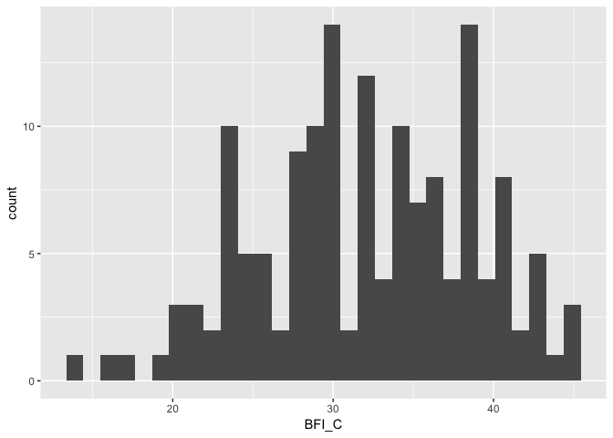

Analysis - BFI
================
Wanitchaya Poonpatanapricha

Big Five
--------

    

Big Five & TIPI
---------------

TIPI
----

### Pre-post

-   no change in TIPI 

<!-- -->

    ## 
    ##  Welch Two Sample t-test
    ## 
    ## data:  survey$TIPI_E_Post and survey$TIPI_E
    ## t = 0.94595, df = 305.92, p-value = 0.3449
    ## alternative hypothesis: true difference in means is not equal to 0
    ## 95 percent confidence interval:
    ##  -0.3857787  1.1000645
    ## sample estimates:
    ## mean of x mean of y 
    ##  8.032468  7.675325

    ## 
    ##  Welch Two Sample t-test
    ## 
    ## data:  survey_tsst$TIPI_E_Post and survey_tsst$TIPI_E
    ## t = 0.3817, df = 151.92, p-value = 0.7032
    ## alternative hypothesis: true difference in means is not equal to 0
    ## 95 percent confidence interval:
    ##  -0.8677635  1.2833480
    ## sample estimates:
    ## mean of x mean of y 
    ##  7.545455  7.337662

    ## 
    ##  Welch Two Sample t-test
    ## 
    ## data:  survey_control$TIPI_E_Post and survey_control$TIPI_E
    ## t = 0.97779, df = 152, p-value = 0.3297
    ## alternative hypothesis: true difference in means is not equal to 0
    ## 95 percent confidence interval:
    ##  -0.5169081  1.5298951
    ## sample estimates:
    ## mean of x mean of y 
    ##  8.519481  8.012987

    ## 
    ##  Paired t-test
    ## 
    ## data:  survey$TIPI_A_Post and survey$TIPI_A
    ## t = 1.8127, df = 153, p-value = 0.07185
    ## alternative hypothesis: true difference in means is not equal to 0
    ## 95 percent confidence interval:
    ##  -0.02217988  0.51568638
    ## sample estimates:
    ## mean of the differences 
    ##               0.2467532

    ## 
    ##  Paired t-test
    ## 
    ## data:  survey_tsst$TIPI_A_Post and survey_tsst$TIPI_A
    ## t = 0.6748, df = 76, p-value = 0.5019
    ## alternative hypothesis: true difference in means is not equal to 0
    ## 95 percent confidence interval:
    ##  -0.3041300  0.6158183
    ## sample estimates:
    ## mean of the differences 
    ##               0.1558442

    ## 
    ##  Paired t-test
    ## 
    ## data:  survey_control$TIPI_A_Post and survey_control$TIPI_A
    ## t = 2.327, df = 76, p-value = 0.02263
    ## alternative hypothesis: true difference in means is not equal to 0
    ## 95 percent confidence interval:
    ##  0.04865573 0.62666894
    ## sample estimates:
    ## mean of the differences 
    ##               0.3376623

    ## 
    ##  Paired t-test
    ## 
    ## data:  survey$TIPI_C_Post and survey$TIPI_C
    ## t = -0.92857, df = 153, p-value = 0.3546
    ## alternative hypothesis: true difference in means is not equal to 0
    ## 95 percent confidence interval:
    ##  -0.4264858  0.1537586
    ## sample estimates:
    ## mean of the differences 
    ##              -0.1363636

    ## 
    ##  Paired t-test
    ## 
    ## data:  survey_tsst$TIPI_C_Post and survey_tsst$TIPI_C
    ## t = -1.7224, df = 76, p-value = 0.08907
    ## alternative hypothesis: true difference in means is not equal to 0
    ## 95 percent confidence interval:
    ##  -0.89615002  0.06498119
    ## sample estimates:
    ## mean of the differences 
    ##              -0.4155844

    ## 
    ##  Paired t-test
    ## 
    ## data:  survey_control$TIPI_C_Post and survey_control$TIPI_C
    ## t = 0.87657, df = 76, p-value = 0.3835
    ## alternative hypothesis: true difference in means is not equal to 0
    ## 95 percent confidence interval:
    ##  -0.1817299  0.4674442
    ## sample estimates:
    ## mean of the differences 
    ##               0.1428571

    ## 
    ##  Paired t-test
    ## 
    ## data:  survey$TIPI_ES_Post and survey$TIPI_ES
    ## t = 1.639, df = 153, p-value = 0.1033
    ## alternative hypothesis: true difference in means is not equal to 0
    ## 95 percent confidence interval:
    ##  -0.04667122  0.50121667
    ## sample estimates:
    ## mean of the differences 
    ##               0.2272727

    ## 
    ##  Paired t-test
    ## 
    ## data:  survey_tsst$TIPI_ES_Post and survey_tsst$TIPI_ES
    ## t = 0.83558, df = 76, p-value = 0.406
    ## alternative hypothesis: true difference in means is not equal to 0
    ## 95 percent confidence interval:
    ##  -0.2695310  0.6591414
    ## sample estimates:
    ## mean of the differences 
    ##               0.1948052

    ## 
    ##  Paired t-test
    ## 
    ## data:  survey_control$TIPI_ES_Post and survey_control$TIPI_ES
    ## t = 1.7113, df = 76, p-value = 0.0911
    ## alternative hypothesis: true difference in means is not equal to 0
    ## 95 percent confidence interval:
    ##  -0.04254649  0.56202701
    ## sample estimates:
    ## mean of the differences 
    ##               0.2597403

    ## 
    ##  Paired t-test
    ## 
    ## data:  survey$TIPI_O_Post and survey$TIPI_O
    ## t = -0.83844, df = 153, p-value = 0.4031
    ## alternative hypothesis: true difference in means is not equal to 0
    ## 95 percent confidence interval:
    ##  -0.3922897  0.1585234
    ## sample estimates:
    ## mean of the differences 
    ##              -0.1168831

    ## 
    ##  Paired t-test
    ## 
    ## data:  survey_tsst$TIPI_O_Post and survey_tsst$TIPI_O
    ## t = -0.75684, df = 76, p-value = 0.4515
    ## alternative hypothesis: true difference in means is not equal to 0
    ## 95 percent confidence interval:
    ##  -0.5659588  0.2542705
    ## sample estimates:
    ## mean of the differences 
    ##              -0.1558442

    ## 
    ##  Paired t-test
    ## 
    ## data:  survey_control$TIPI_O_Post and survey_control$TIPI_O
    ## t = -0.4118, df = 76, p-value = 0.6816
    ## alternative hypothesis: true difference in means is not equal to 0
    ## 95 percent confidence interval:
    ##  -0.4547920  0.2989478
    ## sample estimates:
    ## mean of the differences 
    ##             -0.07792208
