EDA Cognitive
================

-   [Flanker A](#flanker-a)
    -   [ACC](#acc)
    -   [RT](#rt)
-   [Flanker B](#flanker-b)
    -   [ACC](#acc-1)
    -   [RT](#rt-1)
-   [Flanker C](#flanker-c)
    -   [ACC](#acc-2)
    -   [RT](#rt-2)

Flanker A
---------

### ACC

#### ACC\_TOTAL

|    n|       mean|         sd|  min|     median|  max|
|----:|----------:|----------:|----:|----------:|----:|
|  151|  0.9086099|  0.1857524|    0|  0.9666667|    1|

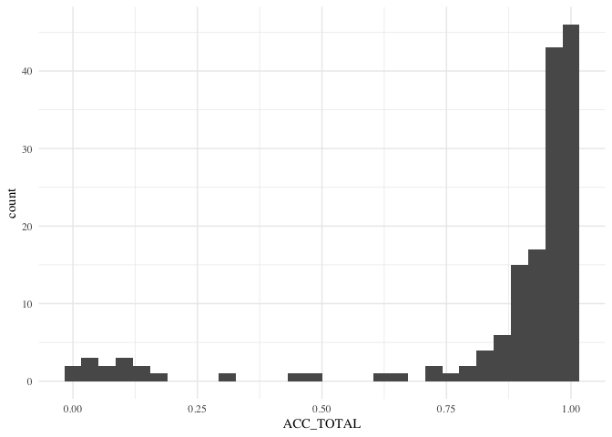

#### ACC\_CON

|    n|       mean|         sd|  min|  median|  max|
|----:|----------:|----------:|----:|-------:|----:|
|  151|  0.9400442|  0.1796473|    0|       1|    1|

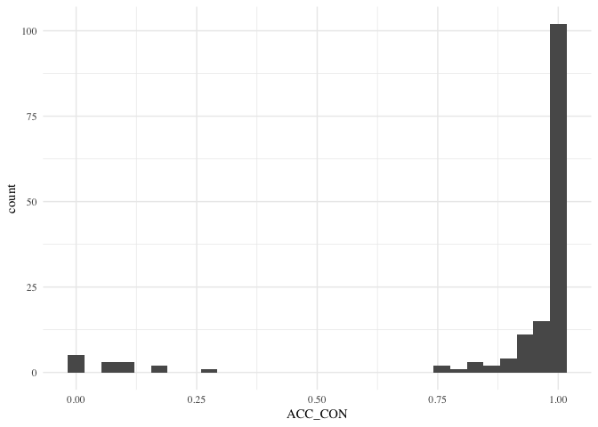

#### ACC\_INCON

|    n|       mean|         sd|  min|  median|  max|
|----:|----------:|----------:|----:|-------:|----:|
|  151|  0.8771755|  0.2079643|    0|    0.95|    1|

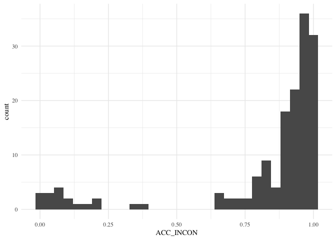

### RT

#### RT\_TOTAL

|    n|      mean|        sd|  min|   median|       max|
|----:|---------:|---------:|----:|--------:|---------:|
|  151|  478.8088|  95.18459|    0|  469.725|  795.7333|

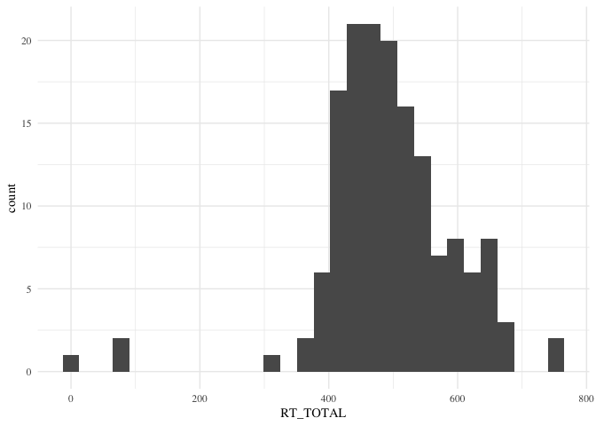

#### RT\_CON

|    n|     mean|       sd|  min|    median|       max|
|----:|--------:|--------:|----:|---------:|---------:|
|  151|  452.173|  96.6474|    0|  438.5833|  776.6833|

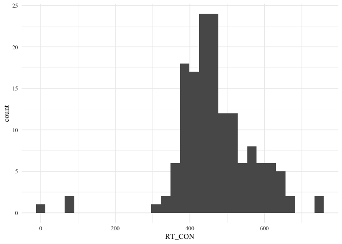

#### RT\_INCON

|    n|      mean|        sd|  min|  median|       max|
|----:|---------:|---------:|----:|-------:|---------:|
|  151|  505.4446|  96.77361|    0|   501.3|  814.7833|

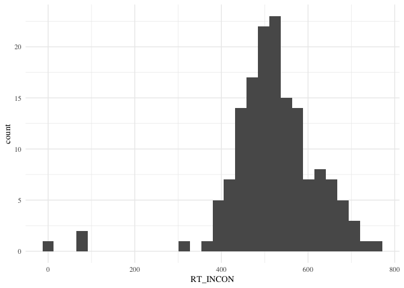

Flanker B
---------

### ACC

#### ACC\_TOTAL

|    n|       mean|         sd|  min|     median|  max|
|----:|----------:|----------:|----:|----------:|----:|
|  150|  0.9086099|  0.1857524|    0|  0.9666667|    1|

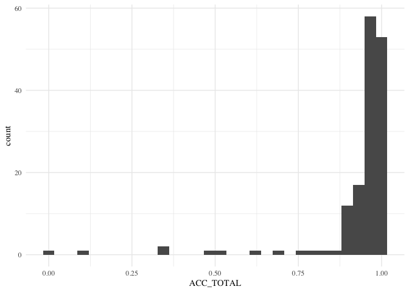

#### ACC\_CON

|    n|       mean|         sd|  min|  median|  max|
|----:|----------:|----------:|----:|-------:|----:|
|  150|  0.9400442|  0.1796473|    0|       1|    1|

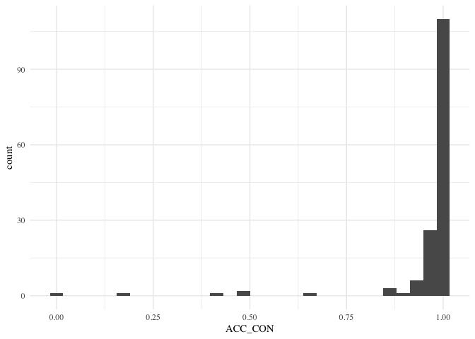

#### ACC\_INCON

|    n|       mean|         sd|  min|  median|  max|
|----:|----------:|----------:|----:|-------:|----:|
|  150|  0.8771755|  0.2079643|    0|    0.95|    1|

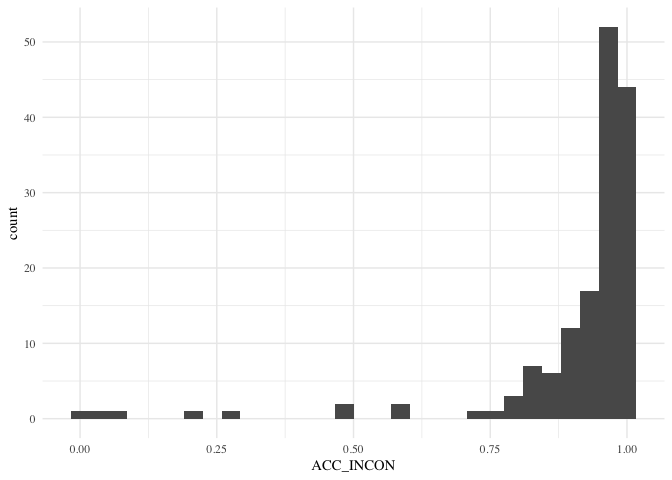

### RT

#### RT\_TOTAL

|    n|      mean|        sd|  min|   median|       max|
|----:|---------:|---------:|----:|--------:|---------:|
|  150|  478.8088|  95.18459|    0|  469.725|  795.7333|

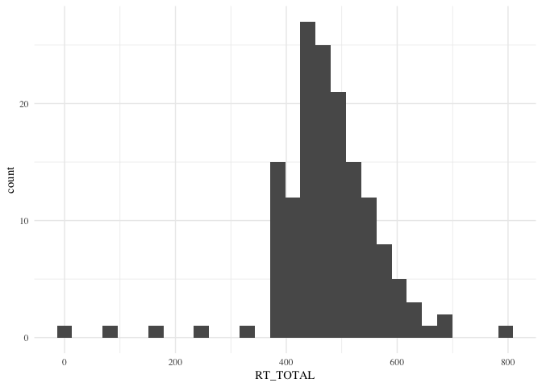

#### RT\_CON

|    n|     mean|       sd|  min|    median|       max|
|----:|--------:|--------:|----:|---------:|---------:|
|  150|  452.173|  96.6474|    0|  438.5833|  776.6833|

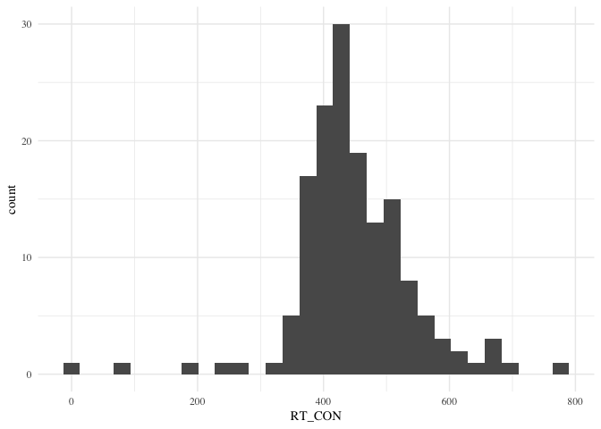

#### RT\_INCON

|    n|      mean|        sd|  min|  median|       max|
|----:|---------:|---------:|----:|-------:|---------:|
|  150|  505.4446|  96.77361|    0|   501.3|  814.7833|

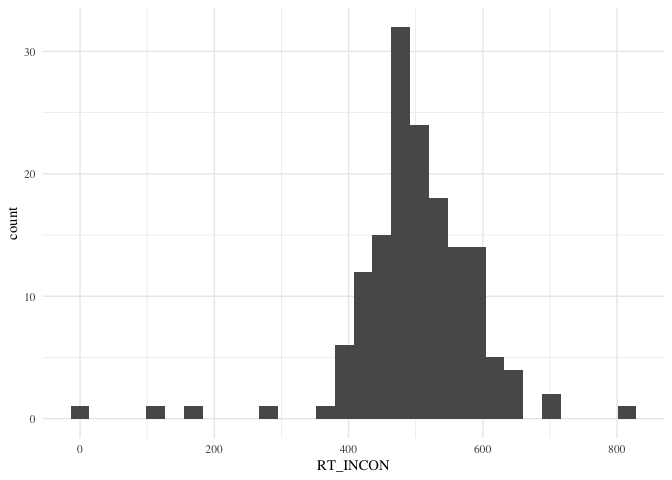

Flanker C
---------

### ACC

#### ACC\_TOTAL

|    n|       mean|         sd|  min|     median|  max|
|----:|----------:|----------:|----:|----------:|----:|
|  151|  0.9086099|  0.1857524|    0|  0.9666667|    1|

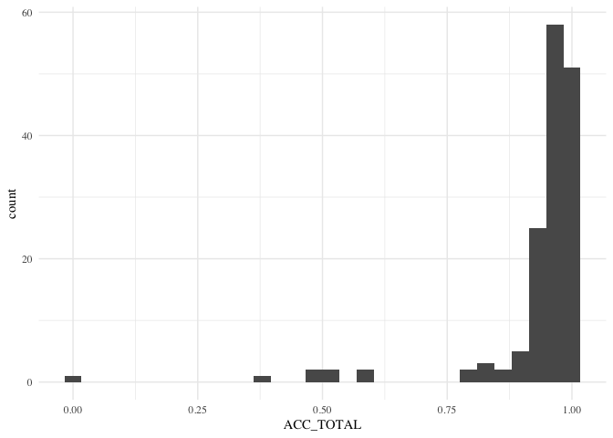

#### ACC\_CON

|    n|       mean|         sd|  min|  median|  max|
|----:|----------:|----------:|----:|-------:|----:|
|  151|  0.9400442|  0.1796473|    0|       1|    1|

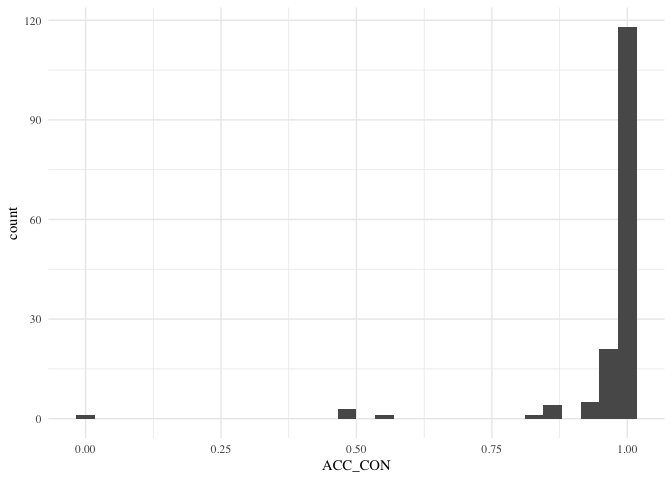

#### ACC\_INCON

|    n|       mean|         sd|  min|  median|  max|
|----:|----------:|----------:|----:|-------:|----:|
|  151|  0.8771755|  0.2079643|    0|    0.95|    1|

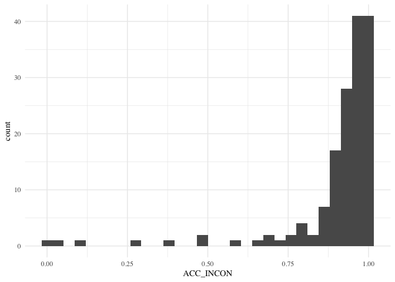

### RT

#### RT\_TOTAL

|    n|      mean|        sd|  min|   median|       max|
|----:|---------:|---------:|----:|--------:|---------:|
|  151|  478.8088|  95.18459|    0|  469.725|  795.7333|

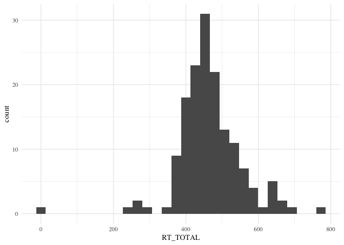

#### RT\_CON

|    n|     mean|       sd|  min|    median|       max|
|----:|--------:|--------:|----:|---------:|---------:|
|  151|  452.173|  96.6474|    0|  438.5833|  776.6833|

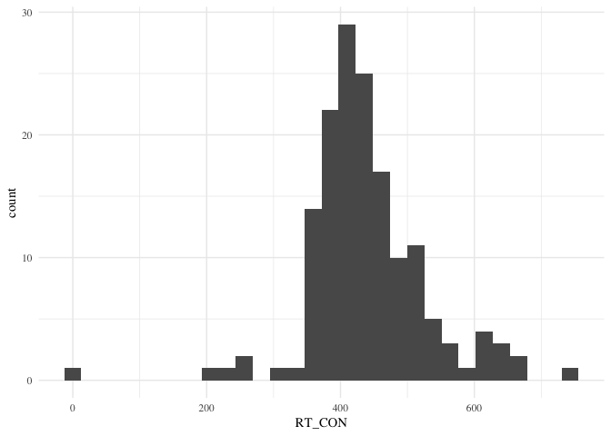

#### RT\_INCON

|    n|      mean|        sd|  min|  median|       max|
|----:|---------:|---------:|----:|-------:|---------:|
|  151|  505.4446|  96.77361|    0|   501.3|  814.7833|

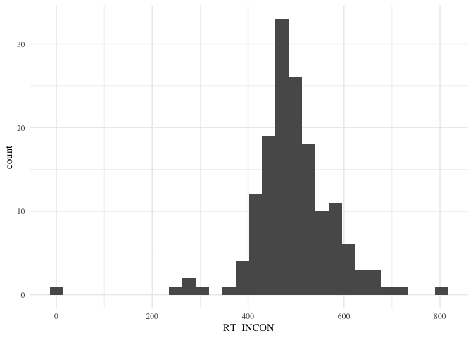
