EDA Hormonal Data
================

-   [Cortisol](#cortisol)
    -   [Baseline](#baseline)
    -   [After TSST](#after-tsst)
    -   [After social interaction](#after-social-interaction)
-   [Testosterone (M)](#testosterone-m)
    -   [Baseline](#baseline-1)
    -   [After TSST](#after-tsst-1)
    -   [After Social Interaction](#after-social-interaction-1)
-   [Testosterone (F)](#testosterone-f)
    -   [Baseline](#baseline-2)
    -   [After TSST](#after-tsst-2)
    -   [After social interaction](#after-social-interaction-2)

``` r
## load the data

# hormone concentration data
hormone <- read_csv("data/2018 Assay Data - Sheet1.csv") %>%
  select(-"Participant #")

# the information of each subject
subject <-
  read_csv(
    "data/Participant Information _ Condition Spreadsheet - Participants.csv",
    col_names = TRUE,
    col_types = cols()
  ) %>%
  slice(2:157) %>%
  select("Participant #","Participant ID", "Condition # (1-8)", 
         "Gender", "TSST/Control Condition", "Judges Sex")
colnames(subject) <- c("number","ID","condition","gender","tsst","judge_sex")
```

``` r
# create a combined dataframe
# each observation = each subject in each hormone in each session
relation <- full_join(subject, hormone, by = c("ID" = "Participant ID")) %>%
  filter(ID != "105C", ID != "113S", ID != "118C", ID != "146C", ID != "151C") %>%
  select(number, everything(), -Cort_A_S1_Conc, -Cort_B_S1_Conc, -Cort_C_S1_Conc, 
         -Cort_A_S2_Conc, -Cort_B_S2_Conc, -Cort_C_S2_Conc, -Testo_A_S1_Conc, 
         -Testo_B_S1_Conc, -Testo_C_S1_Conc, -Testo_A_S2_Conc, -Testo_B_S2_Conc, -Testo_C_S2_Conc) %>%
  unite("Cort", c(Cort_A_Conc, Cort_A_Std_Dev, "CV_(%)_Cort_A",
                  Cort_B_Conc, Cort_B_Std_Dev, "CV_(%)_Cort_B",
                  Cort_C_Conc, Cort_C_Std_Dev, "CV_(%)_Cort_C")) %>%
  unite("Testo", c(Testo_A_Conc, Testo_A_Std_Dev, "CV_(%)_Testo_A",
                  Testo_B_Conc, Testo_B_Std_Dev, "CV_(%)_Testo_B",
                  Testo_C_Conc, Testo_C_Std_Dev, "CV_(%)_Testo_C")) %>%
  gather(Cort, Testo, key = "hormone", value = "value") %>%
  separate(value, into = c("A_Conc", "A_Std", "A_CV", 
                           "B_Conc", "B_Std", "B_CV",
                           "C_Conc", "C_Std", "C_CV"), sep = "_", convert = T) %>%
  # create a column contain difference of concentration between session
  mutate(Diff_B_A = B_Conc - A_Conc,
         Diff_C_B = C_Conc - B_Conc,
         Diff_C_A = C_Conc - A_Conc) %>%
  mutate(per_Diff_base_B_A = Diff_B_A/A_Conc,
         per_Diff_base_C_B = Diff_C_B/A_Conc,
         per_Diff_base_C_A = Diff_C_A/A_Conc) %>%
  mutate(max_Diff = pmax(Diff_B_A, Diff_C_A)) %>%
  mutate(per_Diff_max_B_A = Diff_B_A/max_Diff,
         per_Diff_max_C_B = Diff_C_B/max_Diff,
         per_Diff_max_C_A = Diff_C_A/max_Diff)

log_df <- relation %>%
  select(A_Conc, B_Conc, C_Conc) %>%
  mutate_all(.funs = log)
colnames(log_df) <- paste("log", colnames(log_df), sep = "_")

relation <- cbind(relation,log_df)
```

``` r
# Create a dataframe unique for each hormone/ each condition

## Cortisol
Cort <- relation %>%
  filter(hormone == "Cort")

Cort_F <- Cort %>%
  filter(gender == "F")

Cort_M <- Cort %>%
  filter(gender == "M")

scale_Cort <- Cort %>%
  select(A_Conc, B_Conc, C_Conc, Diff_B_A:Diff_C_A) %>%
  mutate_all(.funs = scale)
colnames(scale_Cort) <- paste("z", colnames(scale_Cort), sep = "_")

scale_Cort <- cbind(Cort,scale_Cort)

write.csv(scale_Cort, "Cortisol.csv")

## Testosterone
Testo <- relation %>%
  filter(hormone == "Testo")

Testo_F <- Testo %>%
  filter(gender == "F")

Testo_M <- Testo %>%
  filter(gender == "M")

scale_Testo_F <- Testo_F %>%
  select(A_Conc, B_Conc, C_Conc, Diff_B_A:Diff_C_A) %>%
  mutate_all(.funs = scale)
colnames(scale_Testo_F) <- paste("z", colnames(scale_Testo_F), sep = "_")

scale_Testo_F <- cbind(Testo_F,scale_Testo_F)

write.csv(scale_Testo_F, "Testosterone_F.csv")

scale_Testo_M <- Testo_M %>%
  select(A_Conc, B_Conc, C_Conc, Diff_B_A:Diff_C_A) %>%
  mutate_all(.funs = scale)
colnames(scale_Testo_M) <- paste("z", colnames(scale_Testo_M), sep = "_")

scale_Testo_M <- cbind(Testo_M,scale_Testo_M)

write.csv(scale_Testo_M, "Testosterone_M.csv")
```

Cortisol
--------

### Baseline

``` r
t.test(Cort_F$A_Conc, Cort_M$A_Conc)
```

    ## 
    ##  Welch Two Sample t-test
    ## 
    ## data:  Cort_F$A_Conc and Cort_M$A_Conc
    ## t = 1.2582, df = 148.41, p-value = 0.2103
    ## alternative hypothesis: true difference in means is not equal to 0
    ## 95 percent confidence interval:
    ##  -0.01683956  0.07586700
    ## sample estimates:
    ## mean of x mean of y 
    ## 0.2066344 0.1771207

There is no significant different between Baseline Cortisol of females and males. Thererfore, we will analyse Cortisol without separation in gender.

``` r
sum_table <- function(df,var){
  rv <- summarise(df,
                  n = n(),
                  mean = mean(var),
                  sd = sd(var),
                  min = min(var),
                  median = median(var),
                  max = max(var)
                  )
  return(rv)
}

kable(sum_table(Cort,Cort$A_Conc))
```

|    n|      mean|        sd|    min|  median|   max|
|----:|---------:|---------:|------:|-------:|-----:|
|  151|  0.195298|  0.153739|  0.027|   0.156|  1.35|

``` r
library(ggrepel)
ggplot(scale_Cort, aes(z_A_Conc)) +
  geom_dotplot(dotsize = 0.4,alpha = 0.7) +
  geom_vline(aes(xintercept = 2),color = "red") +
  geom_vline(aes(xintercept = 3),color = "red")
```

    ## `stat_bindot()` using `bins = 30`. Pick better value with `binwidth`.

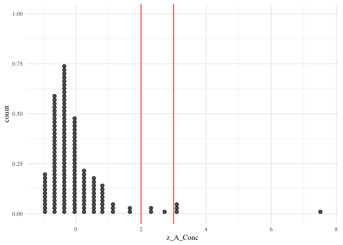

``` r
shapiro.test(scale_Cort$z_A_Conc)
```

    ## 
    ##  Shapiro-Wilk normality test
    ## 
    ## data:  scale_Cort$z_A_Conc
    ## W = 0.67746, p-value < 2.2e-16

The distribution of Baseline Cortisol concentration is skewed to the right.

``` r
ggplot(Cort, aes(log_A_Conc)) +
  geom_dotplot(dotsize = 0.8,alpha = 0.7)
```

    ## `stat_bindot()` using `bins = 30`. Pick better value with `binwidth`.

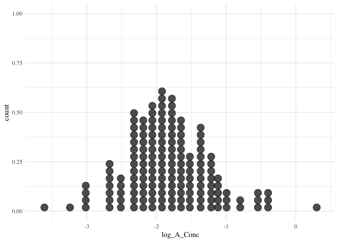

``` r
shapiro.test(Cort$log_A_Conc)
```

    ## 
    ##  Shapiro-Wilk normality test
    ## 
    ## data:  Cort$log_A_Conc
    ## W = 0.98512, p-value = 0.1042

However, the log of Baseline Cortisol concentration is normal distributed. Therefore, we will use log of Baseline Cortisol concentration to analyse from now on.

### After TSST

``` r
t.test(Cort_F$B_Conc, Cort_M$B_Conc)
```

    ## 
    ##  Welch Two Sample t-test
    ## 
    ## data:  Cort_F$B_Conc and Cort_M$B_Conc
    ## t = -0.1838, df = 139.82, p-value = 0.8544
    ## alternative hypothesis: true difference in means is not equal to 0
    ## 95 percent confidence interval:
    ##  -0.06134506  0.05090902
    ## sample estimates:
    ## mean of x mean of y 
    ## 0.2091613 0.2143793

``` r
kable(sum_table(Cort,Cort$B_Conc))
```

|    n|       mean|         sd|    min|  median|    max|
|----:|----------:|----------:|------:|-------:|------:|
|  151|  0.2111656|  0.1779725|  0.025|   0.172|  1.614|

``` r
ggplot(scale_Cort, aes(z_B_Conc)) +
  geom_dotplot(dotsize = 0.4,alpha = 0.7) +
  geom_vline(aes(xintercept = 2),color = "red") +
  geom_vline(aes(xintercept = 3),color = "red")
```

    ## `stat_bindot()` using `bins = 30`. Pick better value with `binwidth`.

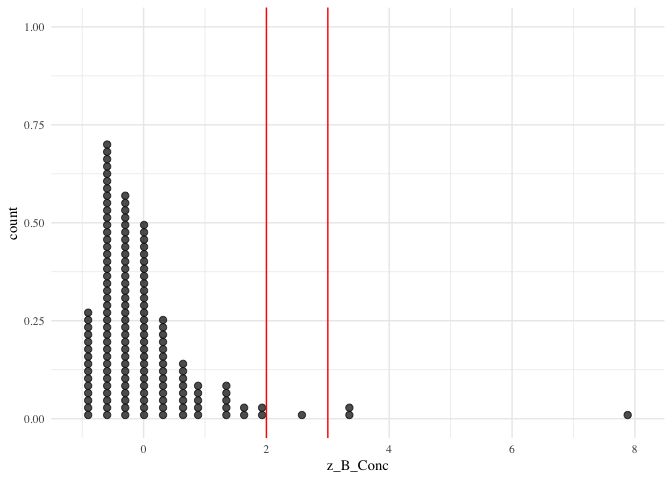

``` r
shapiro.test(scale_Cort$z_B_Conc)
```

    ## 
    ##  Shapiro-Wilk normality test
    ## 
    ## data:  scale_Cort$z_B_Conc
    ## W = 0.66866, p-value < 2.2e-16

``` r
ggplot(Cort, aes(log_B_Conc)) +
  geom_dotplot(dotsize = 0.8,alpha = 0.7)
```

    ## `stat_bindot()` using `bins = 30`. Pick better value with `binwidth`.

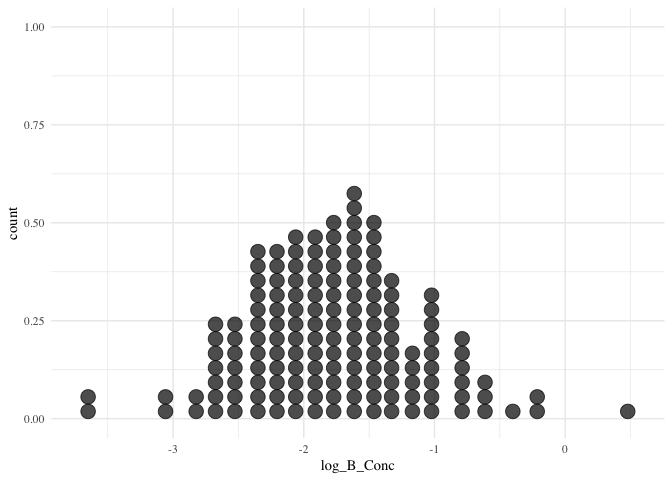

``` r
shapiro.test(Cort$log_B_Conc)
```

    ## 
    ##  Shapiro-Wilk normality test
    ## 
    ## data:  Cort$log_B_Conc
    ## W = 0.991, p-value = 0.453

We will also use log of Cortisol concentration for after TSST.

### After social interaction

``` r
t.test(Cort_F$C_Conc, Cort_M$C_Conc)
```

    ## 
    ##  Welch Two Sample t-test
    ## 
    ## data:  Cort_F$C_Conc and Cort_M$C_Conc
    ## t = 0.46269, df = 146.71, p-value = 0.6443
    ## alternative hypothesis: true difference in means is not equal to 0
    ## 95 percent confidence interval:
    ##  -0.03739846  0.06026312
    ## sample estimates:
    ## mean of x mean of y 
    ## 0.1943978 0.1829655

``` r
kable(sum_table(Cort,Cort$C_Conc))
```

|    n|       mean|         sd|    min|  median|    max|
|----:|----------:|----------:|------:|-------:|------:|
|  151|  0.1900066|  0.1672644|  0.024|   0.156|  1.687|

``` r
ggplot(scale_Cort, aes(z_C_Conc)) +
  geom_dotplot(dotsize = 0.35,alpha = 0.7) +
  geom_vline(aes(xintercept = 2),color = "red") +
  geom_vline(aes(xintercept = 3),color = "red")
```

    ## `stat_bindot()` using `bins = 30`. Pick better value with `binwidth`.

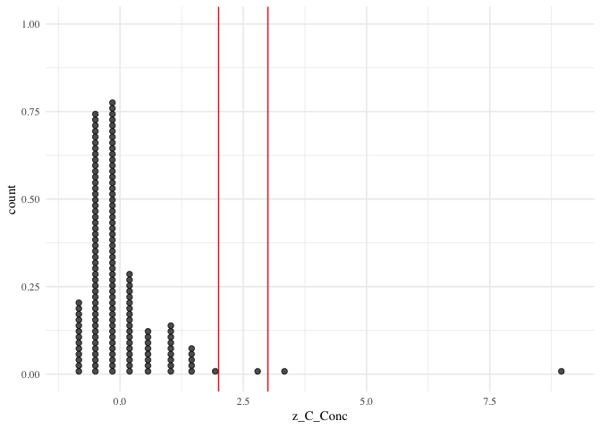

``` r
shapiro.test(scale_Cort$z_C_Conc)
```

    ## 
    ##  Shapiro-Wilk normality test
    ## 
    ## data:  scale_Cort$z_C_Conc
    ## W = 0.58146, p-value < 2.2e-16

``` r
ggplot(Cort, aes(log_C_Conc)) +
  geom_dotplot(dotsize = 0.6,alpha = 0.7)
```

    ## `stat_bindot()` using `bins = 30`. Pick better value with `binwidth`.

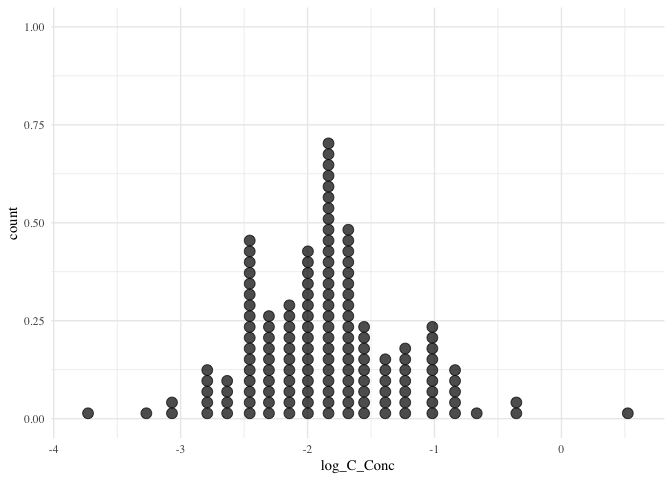

``` r
shapiro.test(Cort$log_C_Conc)
```

    ## 
    ##  Shapiro-Wilk normality test
    ## 
    ## data:  Cort$log_C_Conc
    ## W = 0.97892, p-value = 0.02031

Distribution of log of Cortisol concentration is still not completely normal. However, it is better that the raw data. Thus, we will also use log of Cortisol concentration for after Social interaction.

Testosterone (M)
----------------

### Baseline

``` r
kable(sum_table(Testo_M,Testo_M$A_Conc))
```

|    n|      mean|        sd|     min|    median|      max|
|----:|---------:|---------:|-------:|---------:|--------:|
|   58|  159.0213|  75.26937|  73.688|  150.1805|  517.209|

``` r
ggplot(scale_Testo_M, aes(z_A_Conc)) +
  geom_dotplot(dotsize = 0.7,alpha = 0.7) +
  geom_vline(aes(xintercept = 2),color = "red") +
  geom_vline(aes(xintercept = 3),color = "red")
```

    ## `stat_bindot()` using `bins = 30`. Pick better value with `binwidth`.

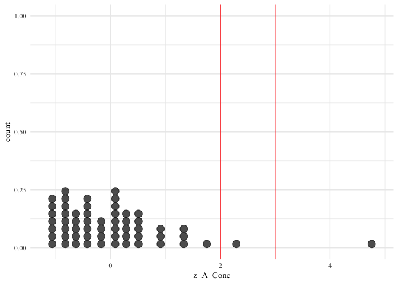

``` r
shapiro.test(scale_Testo_M$z_A_Conc)
```

    ## 
    ##  Shapiro-Wilk normality test
    ## 
    ## data:  scale_Testo_M$z_A_Conc
    ## W = 0.82299, p-value = 7.464e-07

``` r
ggplot(Testo_M, aes(log_A_Conc)) +
  geom_dotplot(dotsize = 0.8,alpha = 0.7)
```

    ## `stat_bindot()` using `bins = 30`. Pick better value with `binwidth`.

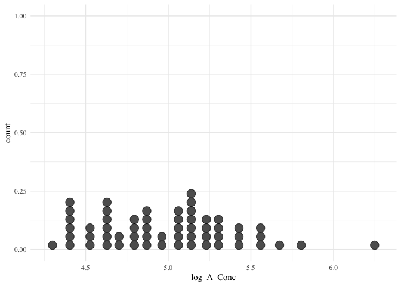

``` r
shapiro.test(Testo_M$log_A_Conc)
```

    ## 
    ##  Shapiro-Wilk normality test
    ## 
    ## data:  Testo_M$log_A_Conc
    ## W = 0.97019, p-value = 0.1635

We will use log for male baseline testosterone.

### After TSST

``` r
kable(sum_table(Testo_M,Testo_M$B_Conc))
```

|    n|     mean|        sd|     min|   median|      max|
|----:|--------:|---------:|-------:|--------:|--------:|
|   58|  153.998|  54.07686|  76.995|  152.861|  328.494|

``` r
ggplot(scale_Testo_M, aes(z_B_Conc)) +
  geom_dotplot(dotsize = 0.8,alpha = 0.7) +
  geom_vline(aes(xintercept = 2),color = "red") +
  geom_vline(aes(xintercept = 3),color = "red")
```

    ## `stat_bindot()` using `bins = 30`. Pick better value with `binwidth`.

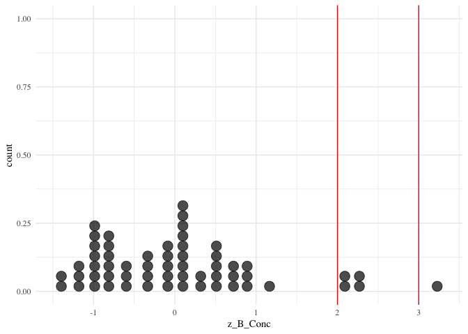

``` r
shapiro.test(scale_Testo_M$z_B_Conc)
```

    ## 
    ##  Shapiro-Wilk normality test
    ## 
    ## data:  scale_Testo_M$z_B_Conc
    ## W = 0.91787, p-value = 0.0007884

``` r
ggplot(Testo_M, aes(log_B_Conc)) +
  geom_dotplot(dotsize = 0.8,alpha = 0.7)
```

    ## `stat_bindot()` using `bins = 30`. Pick better value with `binwidth`.

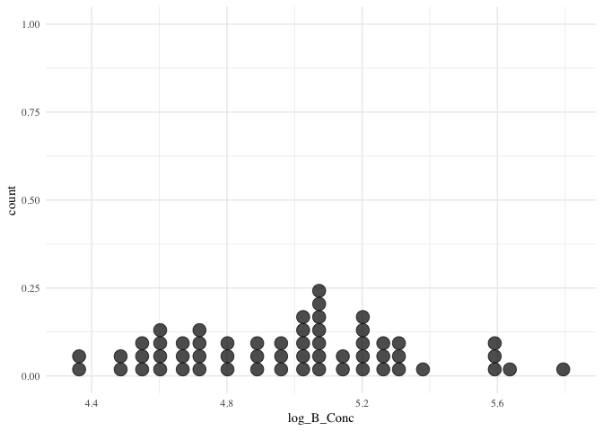

``` r
shapiro.test(Testo_M$log_B_Conc)
```

    ## 
    ##  Shapiro-Wilk normality test
    ## 
    ## data:  Testo_M$log_B_Conc
    ## W = 0.97713, p-value = 0.3409

### After Social Interaction

``` r
kable(sum_table(Testo_M,Testo_M$C_Conc))
```

|    n|      mean|        sd|     min|    median|      max|
|----:|---------:|---------:|-------:|---------:|--------:|
|   58|  163.3518|  81.08336|  79.231|  150.6965|  612.008|

``` r
ggplot(scale_Testo_M, aes(z_C_Conc)) +
  geom_dotplot(dotsize = 0.8,alpha = 0.7) +
  geom_vline(aes(xintercept = 2),color = "red") +
  geom_vline(aes(xintercept = 3),color = "red")
```

    ## `stat_bindot()` using `bins = 30`. Pick better value with `binwidth`.

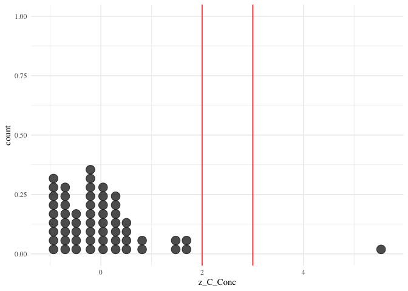

``` r
shapiro.test(scale_Testo_M$z_C_Conc)
```

    ## 
    ##  Shapiro-Wilk normality test
    ## 
    ## data:  scale_Testo_M$z_C_Conc
    ## W = 0.72656, p-value = 4.525e-09

``` r
ggplot(Testo_M, aes(log_C_Conc)) +
  geom_dotplot(dotsize = 0.8,alpha = 0.7)
```

    ## `stat_bindot()` using `bins = 30`. Pick better value with `binwidth`.

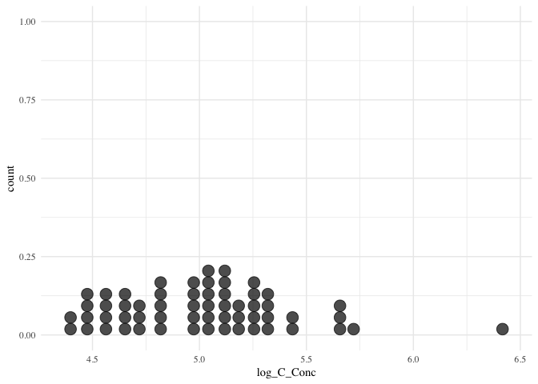

``` r
shapiro.test(Testo_M$log_C_Conc)
```

    ## 
    ##  Shapiro-Wilk normality test
    ## 
    ## data:  Testo_M$log_C_Conc
    ## W = 0.95038, p-value = 0.01895

Testosterone (F)
----------------

### Baseline

``` r
kable(sum_table(Testo_F,Testo_F$A_Conc))
```

|    n|      mean|        sd|    min|  median|      max|
|----:|---------:|---------:|------:|-------:|--------:|
|   93|  52.38039|  19.50623|  10.48|   50.32|  131.311|

``` r
ggplot(scale_Testo_F, aes(z_A_Conc)) +
  geom_dotplot(dotsize = 0.7,alpha = 0.7) +
  geom_vline(aes(xintercept = 2),color = "red") +
  geom_vline(aes(xintercept = 3),color = "red") +
  geom_vline(aes(xintercept = -2),color = "red") 
```

    ## `stat_bindot()` using `bins = 30`. Pick better value with `binwidth`.

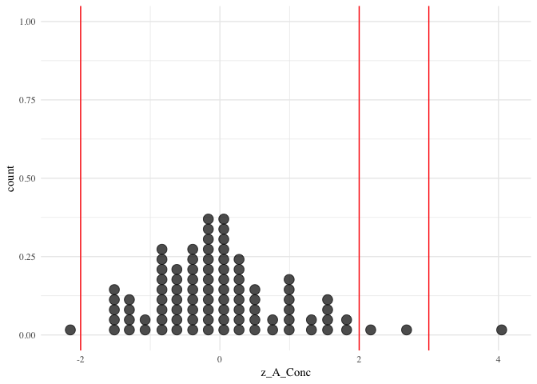

``` r
shapiro.test(scale_Testo_F$z_A_Conc)
```

    ## 
    ##  Shapiro-Wilk normality test
    ## 
    ## data:  scale_Testo_F$z_A_Conc
    ## W = 0.95114, p-value = 0.001596

``` r
ggplot(Testo_F, aes(log_A_Conc)) +
  geom_dotplot(dotsize = 0.8,alpha = 0.7)
```

    ## `stat_bindot()` using `bins = 30`. Pick better value with `binwidth`.

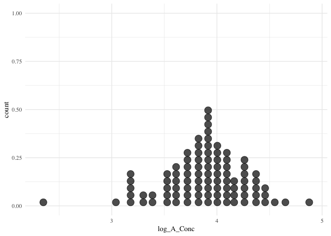

``` r
shapiro.test(Testo_F$log_A_Conc)
```

    ## 
    ##  Shapiro-Wilk normality test
    ## 
    ## data:  Testo_F$log_A_Conc
    ## W = 0.96723, p-value = 0.01941

We will use log for female baseline testosterone.

### After TSST

``` r
kable(sum_table(Testo_F,Testo_F$B_Conc))
```

|    n|      mean|        sd|    min|  median|      max|
|----:|---------:|---------:|------:|-------:|--------:|
|   93|  50.50645|  20.54875|  8.178|  46.194|  128.216|

``` r
ggplot(scale_Testo_F, aes(z_B_Conc)) +
  geom_dotplot(dotsize = 0.8,alpha = 0.7) +
  geom_vline(aes(xintercept = 2),color = "red") +
  geom_vline(aes(xintercept = 3),color = "red") +
  geom_vline(aes(xintercept = -2),color = "red") 
```

    ## `stat_bindot()` using `bins = 30`. Pick better value with `binwidth`.

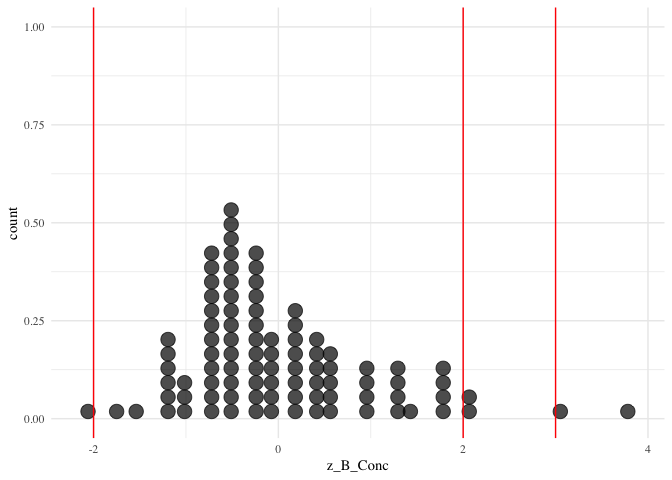

``` r
shapiro.test(scale_Testo_F$z_B_Conc)
```

    ## 
    ##  Shapiro-Wilk normality test
    ## 
    ## data:  scale_Testo_F$z_B_Conc
    ## W = 0.93306, p-value = 0.0001343

``` r
ggplot(Testo_F, aes(log_B_Conc)) +
  geom_dotplot(dotsize = 0.8,alpha = 0.7)
```

    ## `stat_bindot()` using `bins = 30`. Pick better value with `binwidth`.

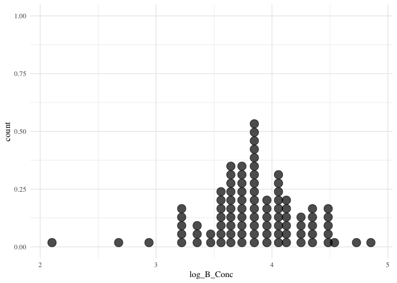

``` r
shapiro.test(Testo_F$log_B_Conc)
```

    ## 
    ##  Shapiro-Wilk normality test
    ## 
    ## data:  Testo_F$log_B_Conc
    ## W = 0.95898, p-value = 0.005209

We will use log for after TSST female testosterone.

### After social interaction

``` r
kable(sum_table(Testo_F,Testo_F$C_Conc))
```

|    n|      mean|        sd|    min|  median|      max|
|----:|---------:|---------:|------:|-------:|--------:|
|   93|  49.38695|  19.64032|  5.865|  45.933|  135.105|

``` r
ggplot(scale_Testo_F, aes(z_C_Conc)) +
  geom_dotplot(dotsize = 0.8,alpha = 0.7) +
  geom_vline(aes(xintercept = 2),color = "red") +
  geom_vline(aes(xintercept = 3),color = "red") +
  geom_vline(aes(xintercept = -2),color = "red") 
```

    ## `stat_bindot()` using `bins = 30`. Pick better value with `binwidth`.

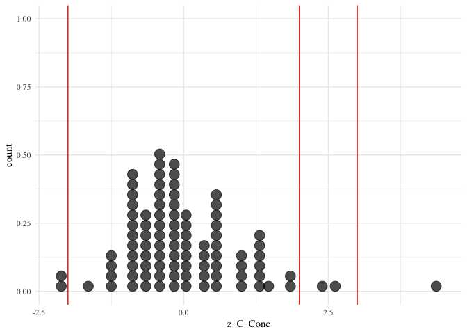

``` r
shapiro.test(scale_Testo_F$z_C_Conc)
```

    ## 
    ##  Shapiro-Wilk normality test
    ## 
    ## data:  scale_Testo_F$z_C_Conc
    ## W = 0.92806, p-value = 7.146e-05

``` r
ggplot(Testo_F, aes(log_C_Conc)) +
  geom_dotplot(dotsize = 0.8,alpha = 0.7)
```

    ## `stat_bindot()` using `bins = 30`. Pick better value with `binwidth`.

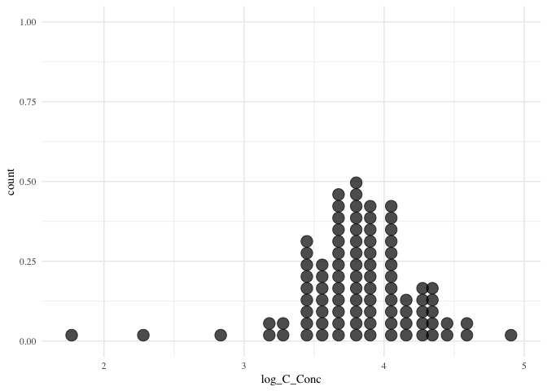

``` r
shapiro.test(Testo_F$log_C_Conc)
```

    ## 
    ##  Shapiro-Wilk normality test
    ## 
    ## data:  Testo_F$log_C_Conc
    ## W = 0.90573, p-value = 5.399e-06

We should use the raw data for female testosterone after Social Interaction.
