EDA Survey
================

-   [Demographic](#demographic)
    -   [Age](#age)
    -   [How many hours did you sleep last night?](#how-many-hours-did-you-sleep-last-night)
    -   [Ethnicity](#ethnicity)
    -   [Maritial Status](#maritial-status)
    -   [Education](#education)
    -   [Raised by](#raised-by)
    -   [Household income](#household-income)
    -   [Current Relationship Status](#current-relationship-status)
    -   [Current Relationship more than 6 months?](#current-relationship-more-than-6-months)
    -   [Current Relationship Commitment](#current-relationship-commitment)
    -   [Current Relationship Length](#current-relationship-length)
    -   [Current Marriage Length](#current-marriage-length)
    -   [Do you have any children?](#do-you-have-any-children)
    -   [Who is dominant?](#who-is-dominant)
    -   [Stable?](#stable)
    -   [Last sexual activity](#last-sexual-activity)
-   [Scales](#scales)
    -   [rMEQ](#rmeq)
    -   [AQ](#aq)
    -   [Anx\_T](#anx_t)
    -   [ACE](#ace)
    -   [Lon](#lon)
    -   [Mac\_SS](#mac_ss)
    -   [sMARS](#smars)
    -   [STAI (Pre)](#stai-pre)
    -   [STAI (Post)](#stai-post)
-   [Personality](#personality)
    -   [BFI](#bfi)
    -   [TIPI (Pre)](#tipi-pre)
    -   [TIPI (Post)](#tipi-post)
-   [Mating](#mating)
    -   [STMO](#stmo)
    -   [LTMO](#ltmo)
    -   [Future\_STMO](#future_stmo)
    -   [Future\_LTMO](#future_ltmo)
    -   [Number of sexual partners](#number-of-sexual-partners)

Demographic
-----------

### Age

|    n|     mean|        sd|  min|  median|  max|
|----:|--------:|---------:|----:|-------:|----:|
|  153|  22.1634|  3.786155|   18|      21|   37|

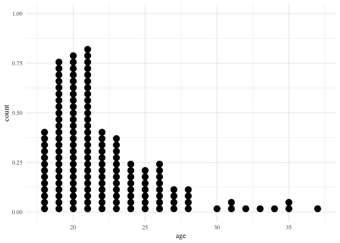

### How many hours did you sleep last night?

|    n|      mean|        sd|  min|  median|  max|
|----:|---------:|---------:|----:|-------:|----:|
|  153|  7.174837|  1.416353|    1|     7.5|   10|

### Ethnicity

|  Dem\_Eth|    n|
|---------:|----:|
|         2|   38|
|         3|   12|
|         4|   26|
|         5|   14|
|         7|   47|
|         8|   11|
|        NA|    5|

### Maritial Status

|  Dem\_Marr|    n|
|----------:|----:|
|          1|  145|
|          2|    7|
|          3|    1|

### Education

|  Dem\_Educ|    n|
|----------:|----:|
|          2|   14|
|          3|   83|
|          4|   56|

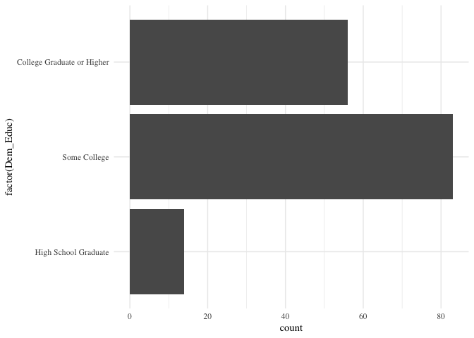

### Raised by

|  Dem\_Raised|    n|
|------------:|----:|
|            1|   15|
|            2|  118|
|            3|   17|
|            4|    1|
|            5|    2|

### Household income

|  Dem\_Inc|    n|
|---------:|----:|
|         1|   22|
|         2|   19|
|         3|   17|
|         4|   16|
|         5|   12|
|         6|   12|
|         7|    8|
|         8|   11|
|         9|    6|
|        11|    4|
|        12|    2|
|        13|    2|
|        14|   22|

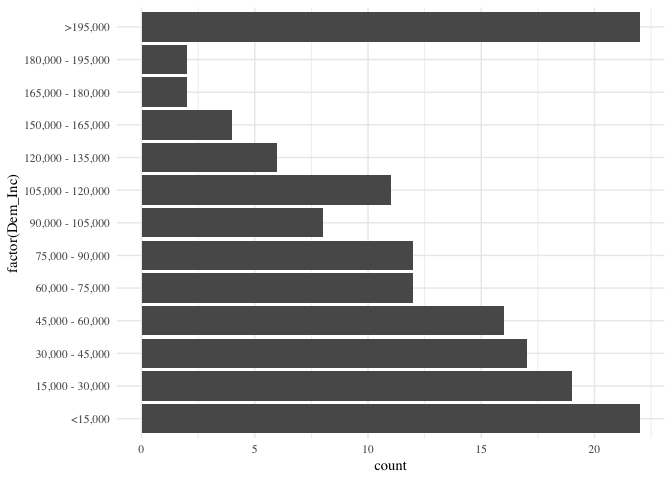

### Current Relationship Status

|  Dem\_RelSta|    n|
|------------:|----:|
|            1|   82|
|            2|   64|
|            3|    7|

### Current Relationship more than 6 months?

|  Dem\_RelTerm|    n|
|-------------:|----:|
|             1|   54|
|             2|   72|
|            NA|   27|

### Current Relationship Commitment

|  Dem\_Commit|    n|
|------------:|----:|
|            1|   71|
|            2|   77|
|           NA|    5|

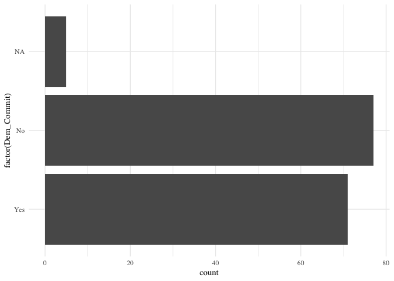

### Current Relationship Length

|    n|      mean|        sd|  min|  median|  max|
|----:|---------:|---------:|----:|-------:|----:|
|  153|  27.63542|  33.25462|   NA|      NA|   NA|

### Current Marriage Length

|    n|  mean|        sd|  min|  median|  max|
|----:|-----:|---------:|----:|-------:|----:|
|  153|    66|  41.43066|   NA|      NA|   NA|

### Do you have any children?

|  Dem\_Child|    n|
|-----------:|----:|
|           1|    3|
|           2|  150|

### Who is dominant?

|  Dem\_RelDom|    n|
|------------:|----:|
|            1|   12|
|            2|   26|
|            3|   75|
|            4|   18|
|            5|    6|
|           NA|   16|

### Stable?

|    n|      mean|        sd|  min|  median|  max|
|----:|---------:|---------:|----:|-------:|----:|
|  153|  2.838235|  1.704984|   NA|      NA|   NA|

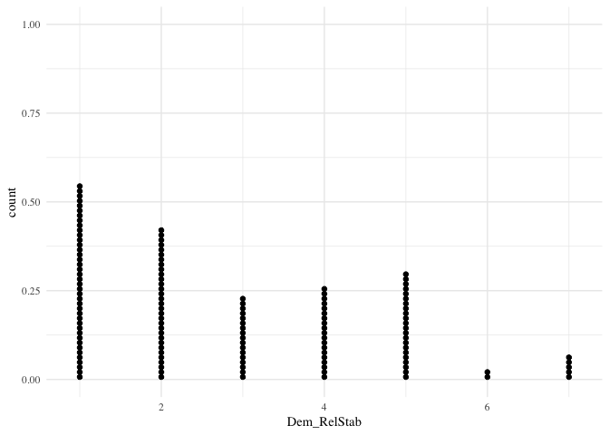

### Last sexual activity

|  Dem\_Sexual\_Activity|    n|
|----------------------:|----:|
|                      1|   13|
|                      2|   42|
|                      3|   22|
|                      4|   24|
|                      5|   13|
|                      6|   16|
|                      7|   23|

Scales
------

### rMEQ

|    n|     mean|        sd|  min|  median|  max|
|----:|--------:|---------:|----:|-------:|----:|
|  153|  13.5817|  3.805492|    0|      13|   25|

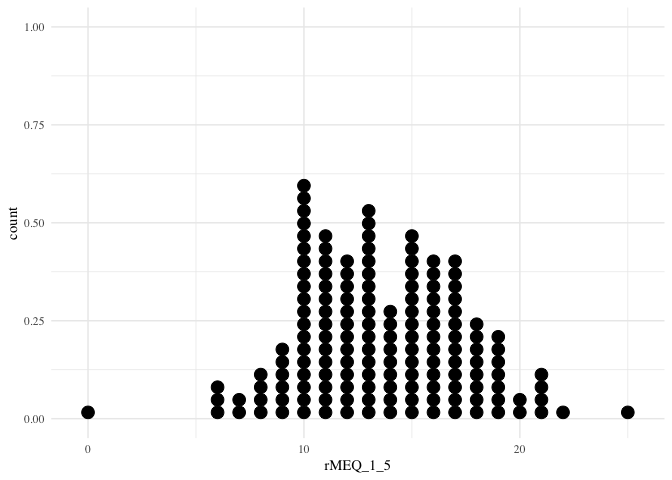

#### Average hours of sleep

|    n|      mean|        sd|  min|  median|  max|
|----:|---------:|---------:|----:|-------:|----:|
|  153|  7.243421|  1.155159|   NA|      NA|   NA|

### AQ

|    n|      mean|        sd|  min|  median|  max|
|----:|---------:|---------:|----:|-------:|----:|
|  153|  97.86275|  17.17674|    0|      98|  138|

### Anx\_T

|    n|      mean|        sd|  min|  median|  max|
|----:|---------:|---------:|----:|-------:|----:|
|  153|  43.21569|  11.29039|    0|      44|   73|

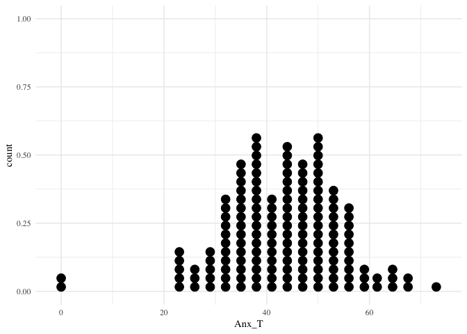

### ACE

|    n|      mean|        sd|  min|  median|  max|
|----:|---------:|---------:|----:|-------:|----:|
|  153|  1.575163|  1.629065|    0|       1|    7|

### Lon

|    n|      mean|        sd|  min|  median|  max|
|----:|---------:|---------:|----:|-------:|----:|
|  153|  5.542484|  1.709058|    0|       6|    9|

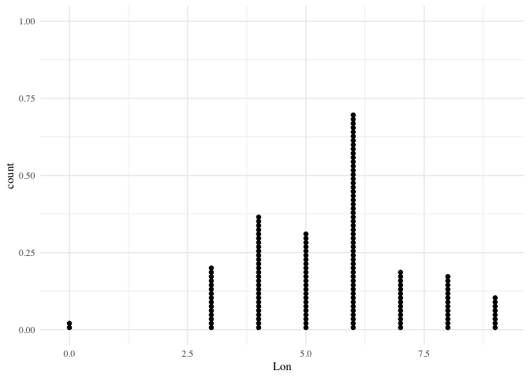

### Mac\_SS

|    n|      mean|        sd|  min|  median|  max|
|----:|---------:|---------:|----:|-------:|----:|
|  153|  6.078431|  2.122962|    0|       6|   17|

### sMARS

|    n|      mean|        sd|  min|  median|  max|
|----:|---------:|---------:|----:|-------:|----:|
|  153|  54.98693|  18.01424|   25|      52|  125|

### STAI (Pre)

|    n|      mean|        sd|  min|  median|  max|
|----:|---------:|---------:|----:|-------:|----:|
|  153|  35.64052|  10.45895|   20|      33|   63|

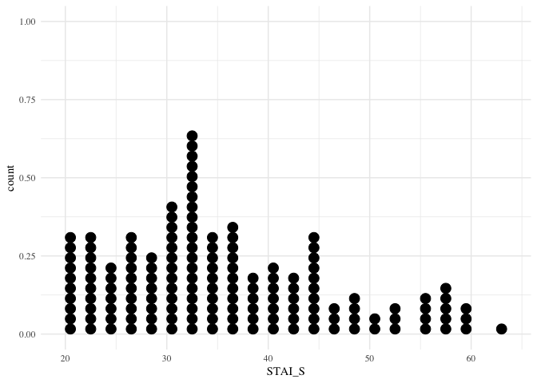

### STAI (Post)

|    n|      mean|       sd|  min|  median|  max|
|----:|---------:|--------:|----:|-------:|----:|
|  153|  38.24183|  12.7207|   20|      36|   73|

Personality
-----------

### BFI

#### BFI\_E

|    n|      mean|        sd|  min|  median|  max|
|----:|---------:|---------:|----:|-------:|----:|
|  153|  24.55556|  6.968811|   11|      24|   40|

#### BFI\_A

|    n|      mean|        sd|  min|  median|  max|
|----:|---------:|---------:|----:|-------:|----:|
|  153|  33.91503|  5.786722|   16|      34|   45|

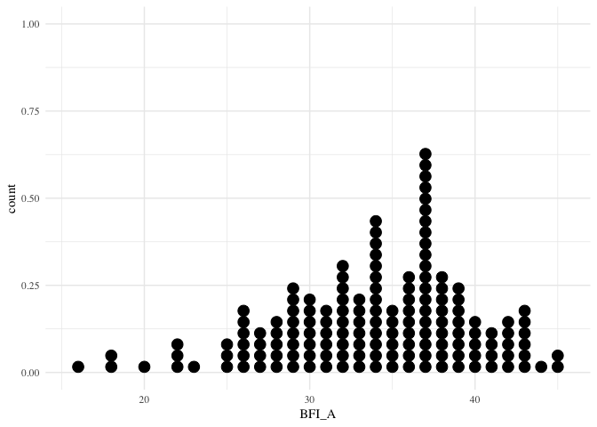

#### BFI\_C

|    n|      mean|        sd|  min|  median|  max|
|----:|---------:|---------:|----:|-------:|----:|
|  153|  32.19608|  6.747376|   14|      32|   45|

#### BFI\_N

|    n|      mean|        sd|  min|  median|  max|
|----:|---------:|---------:|----:|-------:|----:|
|  153|  23.83007|  6.687371|    9|      24|   38|

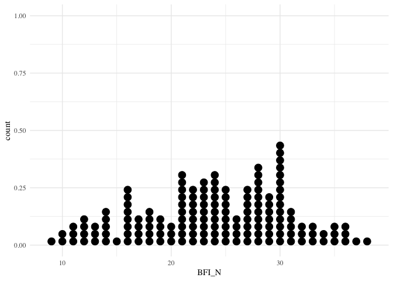

#### BFI\_O

|    n|     mean|        sd|  min|  median|  max|
|----:|--------:|---------:|----:|-------:|----:|
|  153|  38.0915|  6.687931|   18|      39|   50|

### TIPI (Pre)

#### TIPI\_E

|    n|      mean|        sd|  min|  median|  max|
|----:|---------:|---------:|----:|-------:|----:|
|  153|  7.705882|  3.274467|    2|       7|   14|

#### TIPI\_A

|    n|     mean|       sd|  min|  median|  max|
|----:|--------:|--------:|----:|-------:|----:|
|  153|  10.4183|  2.36369|    2|      10|   14|

#### TIPI\_C

|    n|      mean|       sd|  min|  median|  max|
|----:|---------:|--------:|----:|-------:|----:|
|  153|  10.49673|  2.84495|    2|      11|   14|

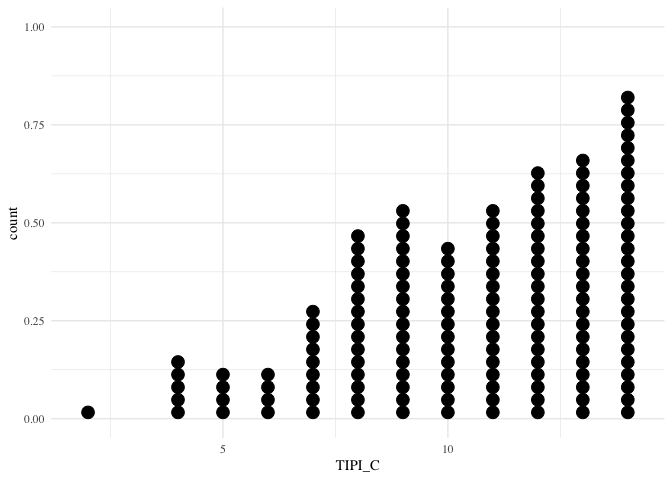

#### TIPI\_ES

|    n|      mean|        sd|  min|  median|  max|
|----:|---------:|---------:|----:|-------:|----:|
|  153|  9.339869|  3.041735|    3|      10|   14|

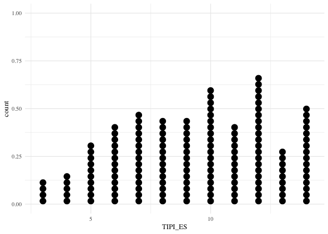

#### TIPI\_O

|    n|      mean|        sd|  min|  median|  max|
|----:|---------:|---------:|----:|-------:|----:|
|  153|  10.84967|  2.145286|    4|      11|   14|

### TIPI (Post)

#### TIPI\_E

|    n|      mean|        sd|  min|  median|  max|
|----:|---------:|---------:|----:|-------:|----:|
|  153|  8.084967|  3.286631|    2|       8|   14|

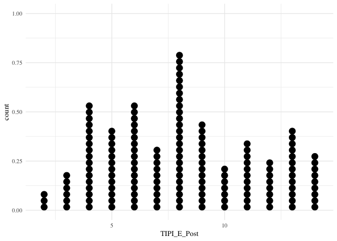

#### TIPI\_A

|    n|     mean|        sd|  min|  median|  max|
|----:|--------:|---------:|----:|-------:|----:|
|  153|  10.7451|  2.341079|    4|      11|   14|

#### TIPI\_C

|    n|      mean|        sd|  min|  median|  max|
|----:|---------:|---------:|----:|-------:|----:|
|  153|  10.45098|  2.869855|    2|      11|   14|

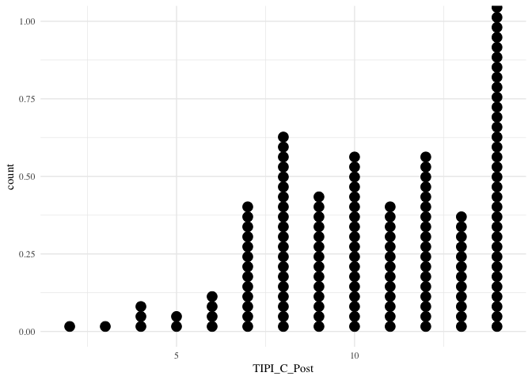

#### TIPI\_ES

|    n|      mean|        sd|  min|  median|  max|
|----:|---------:|---------:|----:|-------:|----:|
|  153|  9.633987|  3.016951|    2|      10|   14|

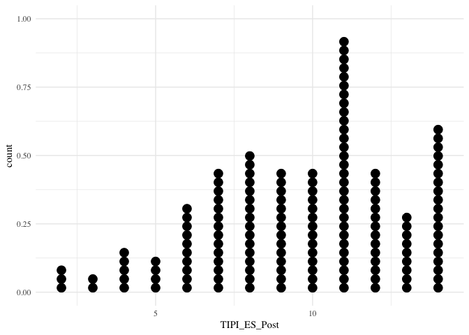

#### TIPI\_O

|    n|      mean|        sd|  min|  median|  max|
|----:|---------:|---------:|----:|-------:|----:|
|  153|  10.77778|  2.213066|    4|      11|   14|

Mating
------

### STMO

|    n|      mean|        sd|  min|  median|  max|
|----:|---------:|---------:|----:|-------:|----:|
|  153|  39.94118|  15.64501|   10|      40|   70|

### LTMO

|    n|      mean|        sd|  min|  median|  max|
|----:|---------:|---------:|----:|-------:|----:|
|  153|  43.40523|  7.270559|   14|      46|   50|

### Future\_STMO

|    n|      mean|        sd|  min|  median|  max|
|----:|---------:|---------:|----:|-------:|----:|
|  153|  2.555556|  1.716364|    1|       2|    7|

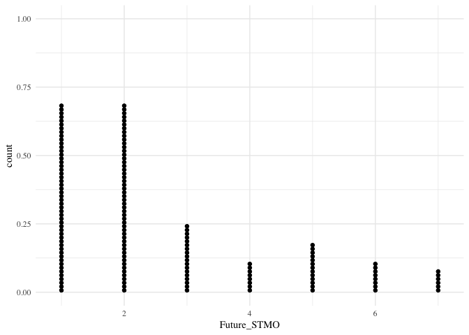

### Future\_LTMO

|    n|      mean|         sd|  min|  median|  max|
|----:|---------:|----------:|----:|-------:|----:|
|  153|  6.503268|  0.8201747|    4|       7|    7|

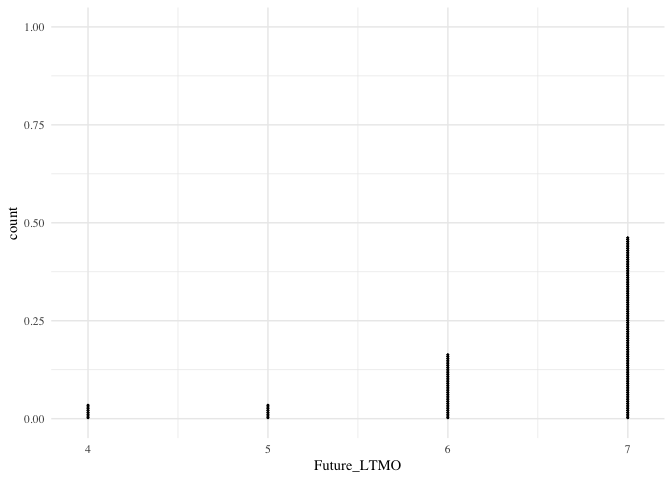

### Number of sexual partners

#### During your entire life, how many partners have you had sexual intercourse with?

|    n|      mean|        sd|  min|  median|  max|
|----:|---------:|---------:|----:|-------:|----:|
|  153|  4.078947|  5.827005|   NA|      NA|   NA|

#### Of these, how many could be characterized as brief sexual relationships?

|    n|      mean|        sd|  min|  median|  max|
|----:|---------:|---------:|----:|-------:|----:|
|  153|  2.479167|  4.961345|   NA|      NA|   NA|

#### How many of these involved high levels of commitment from your partner?

|    n|      mean|        sd|  min|  median|  max|
|----:|---------:|---------:|----:|-------:|----:|
|  153|  1.517241|  1.662927|   NA|      NA|   NA|

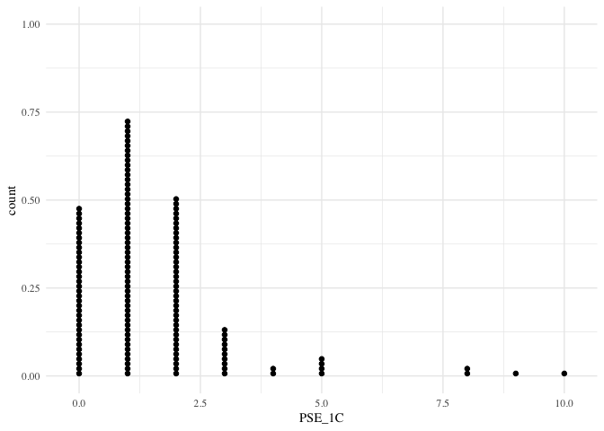

#### How many were you highly committed to?

|    n|      mean|        sd|  min|  median|  max|
|----:|---------:|---------:|----:|-------:|----:|
|  153|  1.409722|  1.406345|   NA|      NA|   NA|

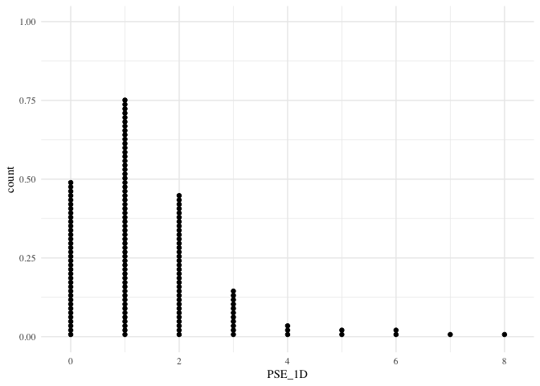

#### How many partners have you had sexual intercourse with in the past year?

|    n|     mean|        sd|  min|  median|  max|
|----:|--------:|---------:|----:|-------:|----:|
|  153|  1.52349|  2.270801|   NA|      NA|   NA|

#### Of these, how many could be characterized as brief sexual relationships?

|    n|       mean|        sd|  min|  median|  max|
|----:|----------:|---------:|----:|-------:|----:|
|  153|  0.7692308|  2.037301|   NA|      NA|   NA|

#### How many of these involved high levels of commitment from your partner?

|    n|       mean|         sd|  min|  median|  max|
|----:|----------:|----------:|----:|-------:|----:|
|  153|  0.7676056|  0.7112619|   NA|      NA|   NA|

#### How many were you highly committed to?

|    n|       mean|         sd|  min|  median|  max|
|----:|----------:|----------:|----:|-------:|----:|
|  153|  0.7746479|  0.6673156|   NA|      NA|   NA|

#### During your entire life, how many partners have you had sexual intercourse with on one and only one occasion?

|    n|  mean|        sd|  min|  median|  max|
|----:|-----:|---------:|----:|-------:|----:|
|  153|  1.25|  2.747603|   NA|      NA|   NA|

#### How many partners do you foresee having sexual intercourse with during the next five years?

|    n|      mean|        sd|  min|  median|  max|
|----:|---------:|---------:|----:|-------:|----:|
|  153|  3.858108|  6.600361|   NA|      NA|   NA|

#### With how many of these partners do you foresee having a long-term, committed (as defined above) sexual relationship?

|    n|      mean|        sd|  min|  median|  max|
|----:|---------:|---------:|----:|-------:|----:|
|  153|  1.527397|  1.210273|   NA|      NA|   NA|

#### With how many of these partners do you foresee yourself having a short-term, uncommitted sexual relationship?

|    n|      mean|        sd|  min|  median|  max|
|----:|---------:|---------:|----:|-------:|----:|
|  153|  2.335616|  6.100625|   NA|      NA|   NA|

#### How often do you fantasize about having sex with someone other than your current dating partner / spouse?

|    n|      mean|        sd|  min|  median|  max|
|----:|---------:|---------:|----:|-------:|----:|
|  153|  2.807947|  2.190024|   NA|      NA|   NA|

